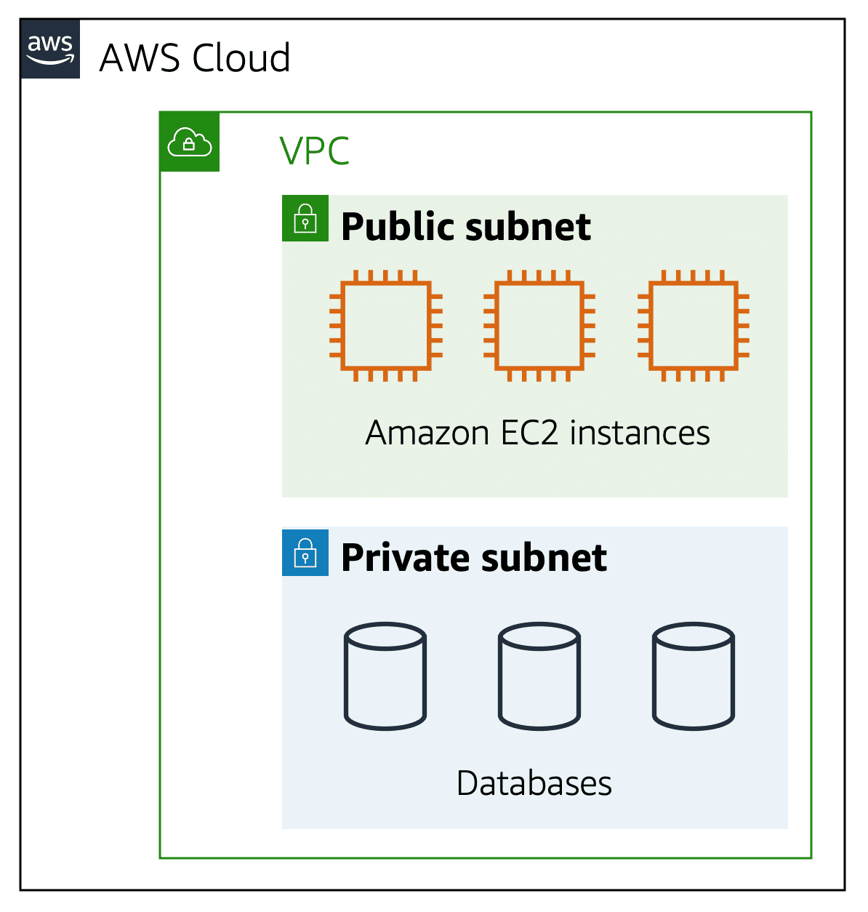

# Course Links

- [Cloud Practitioner - Digital and Classroom Training | AWS (amazon.com)](https://aws.amazon.com/training/learn-about/cloud-practitioner/)

# Course 1: Job Roles in the Cloud

## Shared Responsibility Model

AWS is responsible for security of  the cloud and customer is responsible for security in the cloud. 

- The customer assumes responsibility and management of the guest operating system, including updates and security patches.
- The customer also assumes responsibility for other associated application software and the configuration of the AWS provided security group firewall.

# Course 2: AWS Cloud Practitioner Essentials

## Module 1 Introduction to Amazon Web Services

Benefit of AWS:

1. only pay for what you need

   - You don't need to pay for extra hardware if you do not have that much traffic like in the midnight

   - You can tripple your hardware resource on-demand when high traffic comes

2. AWS helps you do stuff that most of the IT department needs to do but does not make your business better than the competitors

   - e.g. Installing a mysql database and upgrade it

## Module 2 Compute in the Cloud

### EC2 instance types

- General purpose instance
- Compute optimized instances
- Memory optimized instance
  - e.g. high-performance database
- Accelerated computing instances
  - Use hardware accelerators, or coprocessors, to perform some functions more efficiently than is possible in software running on CPUs
  - e.g. Graphics processing
- Storage optimized instances
  - Like data warehousing applications

### EC2 Pricing 

- On-Demand
  - Ad-hoc, short-term contract, more expensive than reserved instances

- Reserved Instances
  - Long-term contract, cheaper than on-demand
  - Two categries:
    - Standard Reserved Instances
    - Convertible Reserved Instances: more flexible, you can change instance type, availability zone... But it's more expensive

- Savings Plans
  - High-customized plan
- Spot Instances
  - Cheapest one. Your program would only be run when there is free computing resource
  - And your program can be interrupted if computing resource short 
- Dedicated Hosts
  - Dedicated physical machines, most expensive

### Scaling Amazon EC2

Auto-scaling group: minimum capacity, desired capacity, max capacity

### Elastic Load Balancing

Short name is ELB. Is a service that AWS enables. Can work together with auto-scaling group

### Amazon Simple Notification Service (Amazon SNS)

**Amazon Simple Notification Service (Amazon SNS)** is a publish/subscribe service. Using Amazon SNS topics, a publisher publishes messages to subscribers. This is similar to the coffee shop; the cashier provides coffee orders to the barista who makes the drinks.

### **Amazon Simple Queue Service (Amazon SQS)****

Amazon Simple Queue Service (Amazon SQS) is a message queuing service. Using Amazon SQS, you can send, store, and receive messages between software components, without losing messages or requiring other services to be available.

### Serverless computing

It's like application container. You do not have to manage or care about the servers that your application run on

#### AWS Lambda

[**AWS Lambda**(opens in a new tab)](https://aws.amazon.com/lambda) is a service that lets you run code without needing to provision or manage servers. 

While using AWS Lambda, you pay only for the compute time that you consume. Charges apply only when your code is running. You can also run code for virtually any type of application or backend service, all with zero administration. 

1. You upload your code to Lambda. 
2. You set your code to trigger from an event source, such as AWS services, mobile applications, or HTTP endpoints.
3. Lambda runs your code only when triggered.
4. You pay only for the compute time that you use. In the previous example of resizing images, you would pay only for the compute time that you use when uploading new images. Uploading the images triggers Lambda to run code for the image resizing function.

#### AWS Fargate

[**AWS Fargate**(opens in a new tab)](https://aws.amazon.com/fargate/) is a serverless compute engine for containers. It works with both Amazon ECS and Amazon EKS. 

When using AWS Fargate, you do not need to provision or manage servers. AWS Fargate manages your server infrastructure for you. You can focus more on innovating and developing your applications, and you pay only for the resources that are required to run your containers.

### Amazon Elastic Container Service (Amazon ECS)

[**Amazon Elastic Container Service (Amazon ECS)**(opens in a new tab)](https://aws.amazon.com/ecs/) is a highly scalable, high-performance container management system that enables you to run and scale containerized applications on AWS. This supports docker

### Amazon Elastic Kubernetes Service (Amazon EKS)

[**Amazon Elastic Kubernetes Service (Amazon EKS)**(opens in a new tab)](https://aws.amazon.com/eks/) is a fully managed service that you can use to run Kubernetes on AWS. 

[Kubernetes(opens in a new tab)](https://kubernetes.io/) is open-source software that enables you to deploy and manage containerized applications at scale.

## Module 3 Global Infrastructure and Reliability

### Availability Zone

An **Availability Zone** is a single data center or a group of data centers within a Region. Availability Zones are located tens of miles apart from each other. This is close enough to have low latency (the time between when content requested and received) between Availability Zones. However, if a disaster occurs in one part of the Region, they are distant enough to reduce the chance that multiple Availability Zones are affected.

One region would contain one or more availability zones

Regional services are by definition already highly available at no additional cost of effort on your part. 

### Edge locations

An **edge location** is a site that Amazon CloudFront (amazon's CDN) uses to store cached copies of your content closer to your customers for faster delivery.

## Module 4 Networking

### Amazon Virtual Private Cloud (Amazon VPC)

A networking service that you can use to establish boundaries around your AWS resources is [**Amazon Virtual Private Cloud (Amazon VPC)**(opens in a new tab)](https://aws.amazon.com/vpc/).

Amazon VPC enables you to provision an isolated section of the AWS Cloud. In this isolated section, you can launch resources in a virtual network that you define. Within a virtual private cloud (VPC), you can organize your resources into subnets. A **subnet** is a section of a VPC that can contain resources such as Amazon EC2 instances.

### Internet gateway

To allow public traffic from the internet to access your VPC, you attach an **internet gateway** to the VPC.

Internet gateway icon attached to a VPC that holds three EC2 instances. An arrow connects the client to the gateway over the internet indicating that the client's request has gained access to the VPC.

### Virtual private gateway

To access private resources in a VPC, you can use a **virtual private gateway**. 

### **AWS Direct Connect**

[**AWS Direct Connect**(opens in a new tab)](https://aws.amazon.com/directconnect/) is a service that lets you to establish a **dedicated** private connection between your data center and a VPC.  It would be a dedicated private pysical cable, not shared with anyone else

### Subnets

A subnet is a section of a VPC in which you can group resources based on security or operational needs. Subnets can be public or private. 

**Public subnets** contain resources that need to be accessible by the public, such as an online store’s website.

**Private subnets** contain resources that should be accessible only through your private network, such as a database that contains customers’ personal information and order histories. 

In a VPC, subnets can communicate with each other. For example, you might have an application that involves Amazon EC2 instances in a public subnet communicating with databases that are located in a private subnet.

### Network ACLs

A network ACL is a virtual firewall that controls inbound and outbound traffic at the subnet level.

By default, your account’s default network ACL allows all inbound and outbound traffic

Network ACLs perform **stateless** packet filtering. They remember nothing and check packets that cross the subnet border each way: inbound and outbound. When a packet response for that request comes back to the subnet, the network ACL does not remember your previous request. The network ACL checks the packet response against its list of rules to determine whether to allow or deny.

### Security Groups

A security group is a virtual firewall that controls inbound and outbound traffic for an Amazon EC2 instance.

By default, a security group denies all inbound traffic and allows all outbound traffic. You can add custom rules to configure which traffic should be allowed; any other traffic would then be denied.

If you have multiple Amazon EC2 instances within the same VPC, you can associate them with the same security group or use different security groups for each instance. 

Security groups perform **stateful** packet filtering. They remember previous decisions made for incoming packets.When a packet response for that request returns to the instance, the security group remembers your previous request. The security group allows the response to proceed, regardless of inbound security group rules.

### Amazon Route 53

[**Amazon Route 53**(opens in a new tab)](https://aws.amazon.com/route53) is a DNS web service. It gives developers and businesses a reliable way to route end users to internet applications hosted in AWS. 

Another feature of Route 53 is the ability to manage the DNS records for domain names. You can register new domain names directly in Route 53. You can also transfer DNS records for existing domain names managed by other domain registrars. This enables you to manage all of your domain names within a single location.

## Module 5 Storage and Databases£

### Instance stores

Block-level storage volumes behave like physical hard drives.

An [**instance store**(opens in a new tab)](https://docs.aws.amazon.com/AWSEC2/latest/UserGuide/InstanceStorage.html) provides temporary block-level storage for an Amazon EC2 instance. An instance store is disk storage that is physically attached to the host computer for an EC2 instance, and therefore has the same lifespan as the instance. When the instance is terminated, you lose any data in the instance store.

### Amazon Elastic Block Store (Amazon EBS)

[**Amazon Elastic Block Store (Amazon EBS)**(opens in a new tab)](https://aws.amazon.com/ebs) is a service that provides block-level storage volumes that you can use with Amazon EC2 instances. If you stop or terminate an Amazon EC2 instance, all the data on the attached EBS volume remains available.

To create an EBS volume, you define the configuration (such as volume size and type) and provision it. After you create an EBS volume, it can attach to an Amazon EC2 instance.

Because EBS volumes are for data that needs to persist, it’s important to back up the data. You can take **incremental** backups of EBS volumes by creating Amazon EBS snapshots.

### Object storage

In **object storage**, each object consists of data, metadata, and a key.

The data might be an image, video, text document, or any other type of file. Metadata contains information about what the data is, how it is used, the object size, and so on. An object’s key is its unique identifier.

Recall that when you modify a file in block storage, only the pieces that are changed are updated. When a file in object storage is modified, the entire object is updated.

### Amazon Simple Storage Service (Amazon S3)

[**Amazon Simple Storage Service (Amazon S3)**(opens in a new tab)](https://aws.amazon.com/s3/) is a service that provides object-level storage. Amazon S3 stores data as objects in buckets.

You can upload any type of file to Amazon S3, such as images, videos, text files, and so on. For example, you might use Amazon S3 to store backup files, media files for a website, or archived documents. Amazon S3 offers unlimited storage space. The maximum file size for an object in Amazon S3 is 5 TB.

When you upload a file to Amazon S3, you can set permissions to control visibility and access to it. You can also use the Amazon S3 versioning feature to track changes to your objects over time.

#### Amazon S3 storage classes

##### S3 Standard

- Designed for frequently accessed data
- Stores data in a minimum of three Availability Zones

##### S3 Standard-Infrequent Access (S3 Standard IA)

- Ideal for infrequently accessed data
- Similar to Amazon S3 Standard but has a lower storage price and higher retrieval price

##### S3 One Zone-Infrequent Access (S3 One Zone IA)

- Stores data in a single Availability Zone (**can lose data**)
- Has a lower storage price than Amazon S3 Standard-IA

##### S3 Intelligient Tiering

- Ideal for data with unknown or changing access patterns
- Requires a small monthly monitoring and automation fee per object

In the S3 Intelligent-Tiering storage class, Amazon S3 monitors objects’ access patterns. If you haven’t accessed an object for 30 consecutive days, Amazon S3 automatically moves it to the infrequent access tier, S3 Standard-IA. If you access an object in the infrequent access tier, Amazon S3 automatically moves it to the frequent access tier, S3 Standard.

##### S3 Glacier Instant Retrieval

- Works well for archived data that requires immediate access
- Can retrieve objects within a few milliseconds

When you decide between the options for archival storage, consider how quickly you must retrieve the archived objects. You can retrieve objects stored in the S3 Glacier Instant Retrieval storage class within milliseconds, with the same performance as S3 Standard.

##### S3 Flexible Retrieval

- Low-cost storage designed for data archiving
- Able to retrieve objects within a few minutes to hours

##### S3 Glacier Deep Archive

- Lowest-cost object storage class ideal for archiving
- Able to retrieve objects within 12 hours

##### S3 Outposts

- Creates S3 buckets on Amazon S3 Outposts
- Makes it easier to retrieve, store, and access data on AWS Outposts

Amazon S3 Outposts delivers object storage to your on-premises AWS Outposts environment. Amazon S3 Outposts is designed to store data durably and redundantly across multiple devices and servers on your Outposts. It works well for workloads with local data residency requirements that must satisfy demanding performance needs by keeping data close to on-premises applications.

### Amazon EBS V.S. Amazon S3

Assume you have 80 GB file that can be updated frequently. Then EBS would be a good option because you update part of the file. If S3 is used, then even if you channge only one bit of the file, you have to re-upload the whole 80GB file again

If your file is mandatory, i.e. once stored, it's never or rarely updated. Then S3 would be a good choice. Because it's:

- web-enabled: each file already has a URL
- region-distributed: no need to do backup to avoid data loss

### File storage

In **file storage**, multiple clients (such as users, applications, servers, and so on) can access data that is stored in shared file folders. In this approach, a storage server uses block storage with a local file system to organize files. Clients access data through file paths.

### Amazon Elastic File System (Amazon EFS)

[**Amazon Elastic File System (Amazon EFS)**(opens in a new tab)](https://aws.amazon.com/efs/) is a scalable file system used with AWS Cloud services and on-premises resources. As you add and remove files, Amazon EFS grows and shrinks automatically. It can scale on demand to petabytes without disrupting applications

### Amazon EFS V.S. Amazon EBS

An Amazon EBS volume stores data in a **single** Availability Zone. To attach an Amazon EC2 instance to an EBS volume, both the Amazon EC2 instance and the EBS volume must reside within the same Availability Zone.

Amazon EFS is a regional service. It stores data in and across **multiple** Availability Zones. The duplicate storage enables you to access data concurrently from all the Availability Zones in the Region where a file system is located. Additionally, on-premises servers can access Amazon EFS using AWS Direct Connect.

EFS automatically scales up its capacity but EBS does not

### Amazon Relational Database Service

[**Amazon Relational Database Service (Amazon RDS)**(opens in a new tab)](https://aws.amazon.com/rds/) is a service that enables you to run relational databases in the AWS Cloud.

Amazon RDS is a managed service that automates tasks such as hardware provisioning, database setup, patching, and backups. With these capabilities, you can spend less time completing administrative tasks and more time using data to innovate your applications. You can integrate Amazon RDS with other services to fulfill your business and operational needs, such as using AWS Lambda to query your database from a serverless application.

Amazon RDS provides a number of different security options. Many Amazon RDS database engines offer encryption at rest (protecting data while it is stored) and encryption in transit (protecting data while it is being sent and received).

Amazon RDS is available on six database engines, which optimize for memory, performance, or input/output (I/O). Supported database engines include:

- Amazon Aurora
- PostgreSQL
- MySQL
- MariaDB
- Oracle Database
- Microsoft SQL Server

### Amazon Aurora

[**Amazon Aurora**(opens in a new tab)](https://aws.amazon.com/rds/aurora/) is an enterprise-class relational database. It is compatible with MySQL and PostgreSQL relational databases. It is up to five times faster than standard MySQL databases and up to three times faster than standard PostgreSQL databases.

Amazon Aurora helps to reduce your database costs by reducing unnecessary input/output (I/O) operations, while ensuring that your database resources remain reliable and available. 

Consider Amazon Aurora if your workloads require high availability. It replicates six copies of your data across three Availability Zones and continuously backs up your data to Amazon S3.

### Amazon DynamoDB

[**Amazon DynamoDB**(opens in a new tab)](https://aws.amazon.com/dynamodb/) is a key-value database service. It delivers single-digit millisecond performance at any scale.

#### Serverless

DynamoDB is serverless, which means that you do not have to provision, patch, or manage servers. 

You also do not have to install, maintain, or operate software.

#### Automatic Scaling

As the size of your database shrinks or grows, DynamoDB automatically scales to adjust for changes in capacity while maintaining consistent performance. 

This makes it a suitable choice for use cases that require high performance while scaling.
