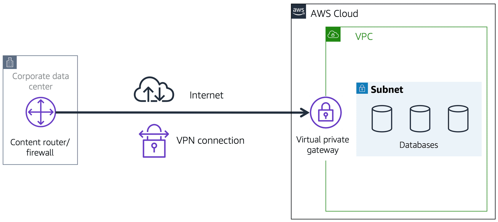

# Course Links

- [Cloud Practitioner - Digital and Classroom Training | AWS (amazon.com)](https://aws.amazon.com/training/learn-about/cloud-practitioner/)

# Course 1: Job Roles in the Cloud

## Shared Responsibility Model

AWS is responsible for security of  the cloud and customer is responsible for security in the cloud. 

- The customer assumes responsibility and management of the guest operating system, including updates and security patches.
- The customer also assumes responsibility for other associated application software and the configuration of the AWS provided security group firewall.

# Course 2: AWS Cloud Practitioner Essentials

## Module 1 Introduction to Amazon Web Services

### Benefit of AWS:

1. only pay for what you need

   - You don't need to pay for extra hardware if you do not have that much traffic like in the midnight

   - You can tripple your hardware resource on-demand when high traffic comes

2. AWS helps you do stuff that most of the IT department needs to do but does not make your business better than the competitors

   - e.g. Installing a mysql database and upgrade it

### Interaction with AWS

Every action that you make in AWS is an API call that is authenticated and authorized. In AWS, you can make API calls to services and resources through the AWS Management Console, AWS Command Line Interface (AWS CLI), or AWS SDKs.

## Module 2 Compute in the Cloud

### EC2 instance types

- General purpose instance
- Compute optimized instances
- Memory optimized instance
  - e.g. high-performance database
- Accelerated computing instances
  - Use hardware accelerators, or coprocessors, to perform some functions more efficiently than is possible in software running on CPUs
  - e.g. Graphics processing
- Storage optimized instances
  - Like data warehousing applications

### EC2 Pricing 

- On-Demand
  - Ad-hoc, short-term contract, more expensive than reserved instances

- Reserved Instances
  - Long-term contract, cheaper than on-demand
  - Two categries:
    - Standard Reserved Instances
    - Convertible Reserved Instances: more flexible, you can change instance type, availability zone... But it's more expensive

- Savings Plans
  - High-customized plan
- Spot Instances
  - Cheapest one. Your program would only be run when there is free computing resource
  - And your program can be interrupted if computing resource short 
- Dedicated Hosts
  - Dedicated physical machines, most expensive

### Scaling Amazon EC2

Auto-scaling group: minimum capacity, desired capacity, max capacity

### Elastic Load Balancing

Short name is ELB. Is a service that AWS enables. Can work together with auto-scaling group

### Amazon Simple Notification Service (Amazon SNS)

**Amazon Simple Notification Service (Amazon SNS)** is a publish/subscribe service. Using Amazon SNS topics, a publisher publishes messages to subscribers. This is similar to the coffee shop; the cashier provides coffee orders to the barista who makes the drinks.

### **Amazon Simple Queue Service (Amazon SQS)**

Amazon Simple Queue Service (Amazon SQS) is a message queuing service. Using Amazon SQS, you can send, store, and receive messages between software components, without losing messages or requiring other services to be available.

### Serverless computing

It's like application container. You do not have to manage or care about the servers that your application run on

#### AWS Lambda

[**AWS Lambda**(opens in a new tab)](https://aws.amazon.com/lambda) is a service that lets you run code without needing to provision or manage servers. 

While using AWS Lambda, you pay only for the compute time that you consume. Charges apply only when your code is running. You can also run code for virtually any type of application or backend service, all with zero administration. 

1. You upload your code to Lambda. 
2. You set your code to trigger from an event source, such as AWS services, mobile applications, or HTTP endpoints.
3. Lambda runs your code only when triggered.
4. You pay only for the compute time that you use. In the previous example of resizing images, you would pay only for the compute time that you use when uploading new images. Uploading the images triggers Lambda to run code for the image resizing function.

#### AWS Fargate

[**AWS Fargate**(opens in a new tab)](https://aws.amazon.com/fargate/) is a serverless compute engine for containers. It works with both Amazon ECS and Amazon EKS. 

When using AWS Fargate, you do not need to provision or manage servers. AWS Fargate manages your server infrastructure for you. You can focus more on innovating and developing your applications, and you pay only for the resources that are required to run your containers.

### Amazon Elastic Container Service (Amazon ECS)

[**Amazon Elastic Container Service (Amazon ECS)**(opens in a new tab)](https://aws.amazon.com/ecs/) is a highly scalable, high-performance container management system that enables you to run and scale containerized applications on AWS. This supports docker

### Amazon Elastic Kubernetes Service (Amazon EKS)

[**Amazon Elastic Kubernetes Service (Amazon EKS)**(opens in a new tab)](https://aws.amazon.com/eks/) is a fully managed service that you can use to run Kubernetes on AWS. 

[Kubernetes(opens in a new tab)](https://kubernetes.io/) is open-source software that enables you to deploy and manage containerized applications at scale.

## Module 3 Global Infrastructure and Reliability

### Region Selection

When you decide which AWS Region to host your applications and workloads, consider four main aspects: latency, price, service availability, and compliance.

### Availability Zone

An **Availability Zone** is a single data center or a group of data centers within a Region. Availability Zones are located tens of miles apart from each other. This is close enough to have low latency (the time between when content requested and received) between Availability Zones. However, if a disaster occurs in one part of the Region, they are distant enough to reduce the chance that multiple Availability Zones are affected.

One region would contain one or more availability zones

Regional services are by definition already highly available at no additional cost of effort on your part. 

#### Name

Availability Zones also have code names. Because they are located inside Regions, they can be addressed by appending a letter to the end of the Region code name. Here are examples of Availability Zone codes:

- **us-east-1a** is an Availability Zone in us-east-1 (N. Virginia Region).
- **sa-east-1b** is an Availability Zone in sa-east-1 (São Paulo Region).

Therefore, if you see that a resource exists in us-east-1c, you can infer that the resource is located in Availability Zone c of the us-east-1 Region.

### Scope of AWS services

For Region-scoped services, AWS automatically performs actions to increase data durability and availability.

On the other hand, some services ask you to specify an Availability Zone. With these services, you are often responsible for increasing the data durability and high availability of these resources.

### Edge locations

An **edge location** is a site that Amazon CloudFront (amazon's CDN) uses to store cached copies of your content closer to your customers for faster delivery.

## Module 4 Networking

### CIDR

It begins with a starting IP address and is separated by a forward slash (the */* character) followed by a number. The number at the end specifies how many of the bits of the IP address are fixed. In this example, the first 24 bits of the IP address are fixed. The rest (the last 8 bits) are flexible.

### Amazon Virtual Private Cloud (Amazon VPC)

A networking service that you can use to establish boundaries around your AWS resources is [**Amazon Virtual Private Cloud (Amazon VPC)**(opens in a new tab)](https://aws.amazon.com/vpc/).

Amazon VPC enables you to provision an isolated section of the AWS Cloud. In this isolated section, you can launch resources in a virtual network that you define. Within a virtual private cloud (VPC), you can organize your resources into subnets. A **subnet** is a section of a VPC that can contain resources such as Amazon EC2 instances.

#### Create a VPC

A virtual private cloud (VPC) is an isolated network that you create in the AWS Cloud, similar to a traditional network in a data center. When you create an Amazon VPC, you must choose three main factors:

- Name of the VPC
- Region where the VPC will live – A VPC spans all the Availability Zones within the selected Region.
- IP range for the VPC in CIDR notation – This determines the size of your network. Each VPC can have up to five CIDRs: one primary and four secondaries for IPv4. Each of these ranges can be between /28 (in CIDR notation) and /16 in size.

Using this information, AWS will provision a network and IP addresses for that network.

### Internet gateway

To allow public traffic from the internet to access your VPC, you attach an **internet gateway** to the VPC. Think of the gateway as similar to a modem.

Internet gateway icon attached to a VPC that holds three EC2 instances. An arrow connects the client to the gateway over the internet indicating that the client's request has gained access to the VPC.

### Virtual private gateway

To access private resources in a VPC from your on-premises data center, you can use a **virtual private gateway**. 

### **AWS Direct Connect**

[**AWS Direct Connect**(opens in a new tab)](https://aws.amazon.com/directconnect/) is a service that lets you to establish a **dedicated** private connection between your data center and a VPC.  It would be a dedicated private pysical cable, not shared with anyone else

### Subnets

A subnet is a section of a VPC in which you can group resources based on security or operational needs. Subnets can be public or private. 

**Public subnets** contain resources that need to be accessible by the public, such as an online store’s website.

**Private subnets** contain resources that should be accessible only through your private network, such as a database that contains customers’ personal information and order histories. 

In a VPC, subnets can communicate with each other. For example, you might have an application that involves Amazon EC2 instances in a public subnet communicating with databases that are located in a private subnet.

#### Craete a subnet

After you create your VPC, you must create subnets inside the network. Think of subnets as smaller networks inside your base network, or virtual local area networks (VLANs) in a traditional, on-premises network. In an on-premises network, the typical use case for subnets is to isolate or optimize network traffic. In AWS, subnets are used to provide high availability and connectivity options for your resources. Use a public subnet for resources that must be connected to the internet and a private subnet for resources that won't be connected to the internet.

When you create a subnet, you must specify the following:

- **VPC** that you want your subnet to live in—in this case: VPC (10.0.0.0/16)
- **Availability Zone** that you want your subnet to live in—in this case: Availability Zone 1
- **IPv4 CIDR block for your subnet**, which must be a subset of the VPC CIDR block—in this case: 10.0.0.0/24

When you launch an EC2 instance, you launch it inside a subnet, which will be located inside the Availability Zone that you choose.

### Reserved IPs 

For AWS to configure your VPC appropriately, AWS reserves five IP addresses in each subnet. These IP addresses are used for routing, Domain Name System (DNS), and network management.

### Amazon VPC Routing

#### Main route table

When you create a VPC, AWS creates a route table called the main route table. A route table contains a set of rules, called routes, that are used to determine where network traffic is directed. AWS assumes that when you create a new VPC with subnets, you want traffic to flow between them. Therefore, the default configuration of the main route table is to allow traffic between all subnets in the local network. The following rules apply to the main route table:

- You cannot delete the main route table.
- You cannot set a gateway route table as the main route table.
- You can replace the main route table with a custom subnet route table.
- You can add, remove, and modify routes in the main route table.
- You can explicitly associate a subnet with the main route table, even if it's already implicitly associated.

#### Custom route tables

The main route table is used implicitly by subnets that do not have an explicit route table association. However, you might want to provide different routes on a per-subnet basis for traffic to access resources outside of the VPC.

If you associate a subnet with a custom route table, the subnet will use it instead of the main route table. 

Each custom route table that you create will have the local route already inside it, allowing communication to flow between all resources and subnets inside the VPC.

### Network ACLs

A network ACL is a virtual firewall that controls inbound and outbound traffic at the subnet level.

By default, your account’s default network ACL allows all inbound and outbound traffic

Network ACLs perform **stateless** packet filtering. They remember nothing and check packets that cross the subnet border each way: inbound and outbound. When a packet response for that request comes back to the subnet, the network ACL does not remember your previous request. The network ACL checks the packet response against its list of rules to determine whether to allow or deny.

### Security Groups

A security group is a virtual firewall that controls inbound and outbound traffic for an Amazon EC2 instance.

By default, a security group denies all inbound traffic and allows all outbound traffic. You can add custom rules to configure which traffic should be allowed; any other traffic would then be denied.

If you have multiple Amazon EC2 instances within the same VPC, you can associate them with the same security group or use different security groups for each instance. 

Security groups perform **stateful** packet filtering. They remember previous decisions made for incoming packets.When a packet response for that request returns to the instance, the security group remembers your previous request. The security group allows the response to proceed, regardless of inbound security group rules.

### Amazon Route 53

[**Amazon Route 53**(opens in a new tab)](https://aws.amazon.com/route53) is a DNS web service. It gives developers and businesses a reliable way to route end users to internet applications hosted in AWS. 

Another feature of Route 53 is the ability to manage the DNS records for domain names. You can register new domain names directly in Route 53. You can also transfer DNS records for existing domain names managed by other domain registrars. This enables you to manage all of your domain names within a single location.

## Module 5 Storage and Databases

### Instance stores

Block-level storage volumes behave like physical hard drives.

An [**instance store**(opens in a new tab)](https://docs.aws.amazon.com/AWSEC2/latest/UserGuide/InstanceStorage.html) provides temporary block-level storage for an Amazon EC2 instance. An instance store is disk storage that is physically attached to the host computer for an EC2 instance, and therefore has the same lifespan as the instance. When the instance is terminated, you lose any data in the instance store.

### Amazon Elastic Block Store (Amazon EBS)

This is corresponding to local machine's external SSD/HDD

[**Amazon Elastic Block Store (Amazon EBS)**(opens in a new tab)](https://aws.amazon.com/ebs) is a service that provides block-level storage volumes that you can use with Amazon EC2 instances. If you stop or terminate an Amazon EC2 instance, all the data on the attached EBS volume remains available.

To create an EBS volume, you define the configuration (such as volume size and type) and provision it. After you create an EBS volume, it can attach to an Amazon EC2 instance.

Because EBS volumes are for data that needs to persist, it’s important to back up the data. You can take **incremental** backups of EBS volumes by creating Amazon EBS snapshots.

### Object storage

In **object storage**, each object consists of data, metadata, and a key.

The data might be an image, video, text document, or any other type of file. Metadata contains information about what the data is, how it is used, the object size, and so on. An object’s key is its unique identifier.

Recall that when you modify a file in block storage, only the pieces that are changed are updated. When a file in object storage is modified, the entire object is updated.

### Amazon Simple Storage Service (Amazon S3)

[**Amazon Simple Storage Service (Amazon S3)**(opens in a new tab)](https://aws.amazon.com/s3/) is a service that provides object-level storage. Amazon S3 stores data as objects in buckets.

You can upload any type of file to Amazon S3, such as images, videos, text files, and so on. For example, you might use Amazon S3 to store backup files, media files for a website, or archived documents. Amazon S3 offers unlimited storage space. The maximum file size for an object in Amazon S3 is 5 TB.

When you upload a file to Amazon S3, you can set permissions to control visibility and access to it. You can also use the Amazon S3 versioning feature to track changes to your objects over time.

#### Bucket

In Amazon S3, you store your objects in containers called buckets. You can’t upload an object, not even a single photo, to Amazon S3 without creating a bucket first. When you store an object in a bucket, the combination of a bucket name, key, and version ID uniquely identifies the object.  

You can configure bucket policy so that only certain IAM role can access this bucket.

Bucket name should be unique. It works like a URL to your domain

#### Amazon S3 storage classes

##### S3 Standard

- Designed for frequently accessed data
- Stores data in a minimum of three Availability Zones

##### S3 Standard-Infrequent Access (S3 Standard IA)

- Ideal for infrequently accessed data
- Similar to Amazon S3 Standard but has a lower storage price and higher retrieval price

##### S3 One Zone-Infrequent Access (S3 One Zone IA)

- Stores data in a single Availability Zone (**can lose data**)
- Has a lower storage price than Amazon S3 Standard-IA

##### S3 Intelligient Tiering

- Ideal for data with unknown or changing access patterns
- Requires a small monthly monitoring and automation fee per object

In the S3 Intelligent-Tiering storage class, Amazon S3 monitors objects’ access patterns. If you haven’t accessed an object for 30 consecutive days, Amazon S3 automatically moves it to the infrequent access tier, S3 Standard-IA. If you access an object in the infrequent access tier, Amazon S3 automatically moves it to the frequent access tier, S3 Standard.

##### S3 Glacier Instant Retrieval

- Works well for archived data that requires immediate access
- Can retrieve objects within a few milliseconds

When you decide between the options for archival storage, consider how quickly you must retrieve the archived objects. You can retrieve objects stored in the S3 Glacier Instant Retrieval storage class within milliseconds, with the same performance as S3 Standard. Compared to IA, it has longer minimum storage duration.

##### S3 Flexible Retrieval

- Low-cost storage designed for data archiving
- Able to retrieve objects within a few minutes to hours

##### S3 Glacier Deep Archive

- Lowest-cost object storage class ideal for archiving
- Able to retrieve objects within 12 hours

##### S3 Outposts

- Creates S3 buckets on Amazon S3 Outposts
- Makes it easier to retrieve, store, and access data on AWS Outposts

Amazon S3 Outposts delivers object storage to your on-premises AWS Outposts environment. Amazon S3 Outposts is designed to store data durably and redundantly across multiple devices and servers on your Outposts. It works well for workloads with local data residency requirements that must satisfy demanding performance needs by keeping data close to on-premises applications.

#### Versioning

If you enable versioning for a bucket, Amazon S3 automatically generates a unique version ID for the object. Similar to git, by using versioning-enabled buckets, you can recover objects from accidental deletion or overwrite.

Buckets can be in one of three states: unversioned (default), Versioning-enabled, Versioning-suspended (new change would not be versioned but old changes' versioning still exists)

#### Managing your storage lifecycle

If you keep manually changing your objects, such as your employee photos, from storage tier to storage tier, you might want to automate the process by configuring their Amazon S3 lifecycle. When you define a lifecycle configuration for an object or group of objects, you can choose to automate between two types of actions: transition and expiration.

- **Transition actions** define when objects should transition to another storage class.
- **Expiration actions** define when objects expire and should be permanently deleted.

### Amazon EBS V.S. Amazon S3

Assume you have 80 GB file that can be updated frequently. Then EBS would be a good option because you update part of the file. If S3 is used, then even if you channge only one bit of the file, you have to re-upload the whole 80GB file again

If your file is mandatory, i.e. once stored, it's never or rarely updated. Then S3 would be a good choice. Because it's:

- web-enabled: each file already has a URL
- region-distributed: no need to do backup to avoid data loss

### File storage

In **file storage**, multiple clients (such as users, applications, servers, and so on) can access data that is stored in shared file folders. In this approach, a storage server uses block storage with a local file system to organize files. Clients access data through file paths.

### Amazon Elastic File System (Amazon EFS)

This is corresponding to NAS in on-premises data center

[**Amazon Elastic File System (Amazon EFS)**(opens in a new tab)](https://aws.amazon.com/efs/) is a scalable file system used with AWS Cloud services and on-premises resources. As you add and remove files, Amazon EFS grows and shrinks automatically. It can scale on demand to petabytes without disrupting applications

### Amazon EFS V.S. Amazon EBS

An Amazon EBS volume stores data in a **single** Availability Zone. To attach an Amazon EC2 instance to an EBS volume, both the Amazon EC2 instance and the EBS volume must reside within the same Availability Zone.

Amazon EFS is a regional service. It stores data in and across **multiple** Availability Zones. The duplicate storage enables you to access data concurrently from all the Availability Zones in the Region where a file system is located. Additionally, on-premises servers can access Amazon EFS using AWS Direct Connect.

EFS automatically scales up its capacity but EBS does not

### Amazon FSx V.S. EFS

- **Use Case & Integration**: EFS is more general-purpose and cloud-native, while FSx is specialized for certain systems (Windows, high-performance computing).
- **Performance**: FSx, especially FSx for Lustre, is designed for higher performance requirements.
- **File System Compatibility**: EFS is more suited for Linux/Unix environments, while FSx offers solutions for both Windows and high-performance computing environments.
- **Pricing Model**: EFS has a pay-as-you-go model based on used storage, while FSx pricing can vary more based on the specific service and configuration options.

### Amazon Relational Database Service

[**Amazon Relational Database Service (Amazon RDS)**(opens in a new tab)](https://aws.amazon.com/rds/) is a service that enables you to run relational databases in the AWS Cloud.

Amazon RDS is a managed service that automates tasks such as hardware provisioning, database setup, patching, and backups. With these capabilities, you can spend less time completing administrative tasks and more time using data to innovate your applications. You can integrate Amazon RDS with other services to fulfill your business and operational needs, such as using AWS Lambda to query your database from a serverless application.

Amazon RDS provides a number of different security options. Many Amazon RDS database engines offer encryption at rest (protecting data while it is stored) and encryption in transit (protecting data while it is being sent and received).

Amazon RDS is available on six database engines, which optimize for memory, performance, or input/output (I/O). Supported database engines include:

- Amazon Aurora
- PostgreSQL
- MySQL
- MariaDB
- Oracle Database
- Microsoft SQL Server

#### RDS Database Instance

Just like the databases you build and manage yourself, Amazon RDS is built from compute and storage.

Underneath the DB instance is an EC2 instance. However, this instance is managed through the Amazon RDS console instead of the Amazon EC2 console.

The storage portion of DB instances for Amazon RDS use Amazon Elastic Block Store (Amazon EBS) volumes for database and log storage.

When using Aurora, data is stored in cluster volumes, which are single, virtual volumes that use solid-state drives (SSDs). A cluster volume contains copies of your data across three Availability Zones in a single AWS Region. For nonpersistent, temporary files, Aurora uses local storage.

#### Backup data

You don’t want to lose your data. To take regular backups of your Amazon RDS instance, you can use automated backups or manual snapshots. To learn about a category, choose the appropriate tab.

#### Redundancy with Amazon RDS Multi-AZ

In an Amazon RDS Multi-AZ deployment, Amazon RDS creates a redundant copy of your database in another Availability Zone. You end up with two copies of your database—a primary copy in a subnet in one Availability Zone and a standby copy in a subnet in a second Availability Zone.

The primary copy of your database provides access to your data so that applications can query and display the information. The data in the primary copy is synchronously replicated to the standby copy. The standby copy is not considered an active database, and it does not get queried by applications.

To improve availability, Amazon RDS Multi-AZ ensures that you have two copies of your database running and that one of them is in the primary role. If an availability issue arises, such as the primary database loses connectivity, Amazon RDS initiates an automatic failover.

When you create a DB instance, a Domain Name System (DNS) name is provided. AWS uses that DNS name to fail over to the standby database. In an automatic failover, the standby database is promoted to the primary role, and queries are redirected to the new primary database.

To help ensure that you don't lose Multi-AZ configuration, there are two ways you can create a new standby database. They are as follows:

- Demote the previous primary to standby if it's still up and running.
- Stand up a new standby DB instance.

The reason you can select multiple subnets for an Amazon RDS database is because of the Multi-AZ configuration. You will want to ensure that you have subnets in different Availability Zones for your primary and standby copies.

### Amazon Aurora

[**Amazon Aurora**(opens in a new tab)](https://aws.amazon.com/rds/aurora/) is an enterprise-class relational database. It is compatible with MySQL and PostgreSQL relational databases. It is up to five times faster than standard MySQL databases and up to three times faster than standard PostgreSQL databases.

Amazon Aurora helps to reduce your database costs by reducing unnecessary input/output (I/O) operations, while ensuring that your database resources remain reliable and available. 

Consider Amazon Aurora if your workloads require high availability. It replicates six copies of your data across three Availability Zones and continuously backs up your data to Amazon S3.

### Amazon DynamoDB

[**Amazon DynamoDB**(opens in a new tab)](https://aws.amazon.com/dynamodb/) is a key-value database service. It delivers single-digit millisecond performance at any scale.

#### Serverless

DynamoDB is serverless, which means that you do not have to provision, patch, or manage servers. 

You also do not have to install, maintain, or operate software.

#### Automatic Scaling

As the size of your database shrinks or grows, DynamoDB automatically scales to adjust for changes in capacity while maintaining consistent performance. 

This makes it a suitable choice for use cases that require high performance while scaling.

### Amazon Redshift

[**Amazon Redshift**(opens in a new tab)](https://aws.amazon.com/redshift) is a data warehousing service that you can use for big data analytics. It offers the ability to collect data from many sources and helps you to understand relationships and trends across your data.

### AWS Database Migration Service (AWS DMS)

[**AWS Database Migration Service (AWS DMS)**(opens in a new tab)](https://aws.amazon.com/dms/) enables you to migrate relational databases, nonrelational databases, and other types of data stores.

With AWS DMS, you move data between a source database and a target database. [The source and target databases(opens in a new tab)](https://aws.amazon.com/dms/resources) can be of the same type or different types. During the migration, your source database remains operational, reducing downtime for any applications that rely on the database. 

It can also be used for other purposes:

- Developent and test database migration: Enabling developers to test applications against production data without affecting production users
- Database consolidation: Combining several databases into a single database
- Continuous replication: Sending ongoing copies of your data to other target sources instead of doing a one-time migration

### Additional Database Services

#### Amazon DocumentDB

[**Amazon DocumentDB**(opens in a new tab)](https://aws.amazon.com/documentdb) is a document database service that supports MongoDB workloads. (MongoDB is a document database program.)

#### Amazon Neptune

[**Amazon Neptune**(opens in a new tab)](https://aws.amazon.com/neptune) is a graph database service. 

You can use Amazon Neptune to build and run applications that work with highly connected datasets, such as recommendation engines, fraud detection, and knowledge graphs.

#### Amazon Quantum Ledger Database (Amazon QLDB)

[**Amazon Quantum Ledger Database (Amazon QLDB)**(opens in a new tab)](https://aws.amazon.com/qldb) is a ledger database service. 

You can use Amazon QLDB to review a complete history of all the changes that have been made to your application data.

#### Amazon Managed Blockchain

[**Amazon Managed Blockchain**(opens in a new tab)](https://aws.amazon.com/managed-blockchain) is a service that you can use to create and manage blockchain networks with open-source frameworks. 

Blockchain is a distributed ledger system that lets multiple parties run transactions and share data without a central authority.

#### Amazon ElastiCache

[**Amazon ElastiCache**(opens in a new tab)](https://aws.amazon.com/elasticache) is a service that adds caching layers on top of your databases to help improve the read times of common requests. 

It supports two types of data stores: Redis and Memcached.

#### Amazon DynamoDB Accelerator

[**Amazon DynamoDB Accelerator (DAX)**(opens in a new tab)](https://aws.amazon.com/dynamodb/dax/) is an in-memory cache for DynamoDB. 

It helps improve response times from single-digit milliseconds to microseconds.

## Module 6 Security

### The AWS shared responsibility model

The shared responsibility model divides into customer responsibilities (commonly referred to as “security in the cloud”) and AWS responsibilities (commonly referred to as “security of the cloud”).

### Root User

When you first create an AWS account, you begin with a single sign-in identity that has complete access to all AWS services and resources in the account. This identity is called the AWS root user and is accessed by signing in with the email address and password that were used to create the account. 

Access keys allow you to make programmatic requests from the AWS Command Line Interface (AWS CLI) or AWS API.

Access keys consist of two parts:

- **Access key ID:** for example, ***A2lAl5EXAMPLE***
- **Secret access key:** for example, ***wJalrFE/KbEKxE***

### AWS Identity and Access Management (IAM)

[**AWS Identity and Access Management (IAM)**(opens in a new tab)](https://aws.amazon.com/iam/) enables you to manage access to AWS services and resources securely.  

IAM gives you the flexibility to configure access based on your company’s specific operational and security needs. You do this by using a combination of IAM features, which are explored in detail in this lesson:

- IAM users, groups, and roles
- IAM policies
- Multi-factor authentication

#### IAM users

An **IAM user** is an identity that you create in AWS. It represents the person or application that interacts with AWS services and resources. It consists of a name and credentials.

By default, when you create a new IAM user in AWS, it has no permissions associated with it

#### IAM policies

An **IAM** **policy** is a document that allows or denies permissions to AWS services and resources.  

IAM policies enable you to customize users’ levels of access to resources. For example, you can allow users to access all of the Amazon S3 buckets within your AWS account, or only a specific bucket.

This example IAM policy allows permission to access the objects in the Amazon S3 bucket with ID: *AWSDOC-EXAMPLE-BUCKET*.

#### IAM groups

An IAM group is a collection of IAM users. When you assign an IAM policy to a group, all users in the group are granted permissions specified by the policy.

#### IAM roles

An IAM role is an identity that you can assume to gain temporary access to permissions.  

Before an IAM user, application, or service can assume an IAM role, they must be granted permissions to switch to the role. When someone assumes an IAM role, they abandon all previous permissions that they had under a previous role and assume the permissions of the new role. 

Best practice:

IAM roles are ideal for situations in which access to services or resources needs to be granted temporarily, instead of long-term.  

##### Understanding AWS Role Assumption in Context of JWT Access Tokens

AWS role assumption in Amazon Web Services (AWS) aligns with the concept of JWT (JSON Web Tokens) access tokens, focusing on secure, temporary access to AWS resources.

###### Similarities with JWT Access Tokens

- **Temporary Credentials**: Like JWT tokens, assuming an AWS role provides temporary security credentials.
- **Limited Lifetime**: These credentials have a limited lifetime, similar to the time-bound validity of JWT tokens.

###### Key Aspects of AWS Role Assumption

1. **Role Creation and Trust Policy**: An IAM role is created with specific permissions. The role’s trust policy dictates who can assume it, akin to how an authentication server governs JWT token issuance.
   1. You can attach specific role to an EC2 instance when creating EC2 instance
2. **Assume Role via AWS STS**: Temporary security credentials are obtained by assuming the role through the AWS STS (Security Token Service), similar to how a user receives a JWT token after authentication.
3. **Expiration and Renewal**: Just like JWT tokens, these AWS credentials must be renewed after their expiration.

###### Usage Scenarios

- **Cross-Account Access**: AWS roles can be assumed by users from different AWS accounts, similar to how JWT tokens enable access across various services.
- **Federation**: In federated scenarios, AWS roles can be assumed, paralleling JWT tokens in federated identity systems.

### Identity Provider

If you decide to make your cat photo application into a business and begin to have more than a handful of people working on it, consider managing employee identity information through an identity provider (IdP). Using an IdP, whether it's with an AWS service such as AWS IAM Identity Center (successor to AWS Single Sign-On) or a third-party identity provider, provides a single source of truth for all identities in your organization.

You no longer have to create separate IAM users in AWS. You can instead use IAM roles to provide permissions to identities that are *federated* from your IdP. Being federated is a process that allows for the transfer of identity and authentication information across a set of networked systems. 

For example, your employee Martha has access to multiple AWS accounts. Instead of creating and managing multiple IAM users named Martha in each of those AWS accounts, you could manage Martha in your company’s IdP. If Martha moves in the company or leaves the company, Martha can be updated in the IdP rather than in every AWS account in the company.

### AWS Organizations

Suppose that your company has multiple AWS accounts. You can use [**AWS Organizations**(opens in a new tab)](https://aws.amazon.com/organizations) to consolidate and manage multiple AWS accounts within a central location.

When you create an organization, AWS Organizations automatically creates a **root**, which is the parent container for all the accounts in your organization. 

Consolidated billing is another feature of AWS Organizations. You will learn about consolidated billing in a later module.

#### Service control policies (SCPs)

In AWS Organizations, you can centrally control permissions for the accounts in your organization by using [**service control policies (SCPs)**(opens in a new tab)](https://docs.aws.amazon.com/organizations/latest/userguide/orgs_manage_policies_scps.html). SCPs enable you to place restrictions on the AWS services, resources, and individual API actions that users and roles in each account can access.

SCPs are similar to AWS Identity and Access Management (IAM) permission policies and use almost the same syntax. However, an SCP never grants permissions. Instead, SCPs are JSON policies that specify the maximum permissions for the affected accounts. 

#### Explanation from ChatGPT

In AWS, an Identity Provider (IdP) is like a security guard at the entrance of a building (AWS). This security guard doesn't work directly for the building but is trusted by it.

1. **Job of IdP**: When someone (a user) wants to enter the building (use AWS services), they show their ID (credentials) to this security guard (IdP). The guard checks if the ID is valid and tells the building who this person is and if they should be allowed in.
2. **Federation**: Imagine people from a partner company need to enter your building frequently. Instead of issuing them new IDs, your building trusts the IDs given by their company. This is like federation in AWS, where AWS trusts an external system's verification of users.
3. **Types of IDs Accepted**: AWS's IdP can understand two types of IDs – SAML (a standard format for exchanging authentication information) and OpenID Connect (another format, used for web-based authentication).
4. **Roles in AWS**: In AWS, you don’t give permissions to each person directly. Instead, you assign permissions to roles (like job titles in a company). When the IdP tells AWS who the person is, AWS lets them assume a role with certain permissions.
5. **Integration with Other Companies**: AWS can work with various external IdPs like Okta or Microsoft Active Directory. This means AWS can trust the IDs issued by these external systems.
6. **AWS's Own IdP Services**: AWS offers services like IAM Identity Center and AWS Directory Service. These are like AWS having its own team to issue IDs and manage who can enter the building.

So, an Identity Provider in AWS is essentially a trusted system that verifies who someone is and what they can do in AWS, based on their identity. This is especially useful for companies that want to use their existing systems to manage access to AWS.

#### Organizational units

In AWS Organizations, you can group accounts into organizational units (OUs) to make it easier to manage accounts with similar business or security requirements. When you apply a policy to an OU, all the accounts in the OU automatically inherit the permissions specified in the policy.  

### Compliance

#### AWS Artifact

Depending on your company’s industry, you may need to uphold specific standards. An audit or inspection will ensure that the company has met those standards.

[**AWS Artifact**(opens in a new tab)](https://aws.amazon.com/artifact) is a service that provides on-demand access to AWS security and compliance reports and select online agreements. AWS Artifact consists of two main sections: AWS Artifact Agreements and AWS Artifact Reports.

#### Customer Compliance Center

The [**Customer Compliance Center**(opens in a new tab)](https://aws.amazon.com/compliance/customer-center/) contains resources to help you learn more about AWS compliance. 

In the Customer Compliance Center, you can read customer compliance stories to discover how companies in regulated industries have solved various compliance, governance, and audit challenges.

### AWS Shield for DDoS attack

AWS Shield is a service that protects applications against DDoS attacks. AWS Shield provides two levels of protection: Standard and Advanced.

#### AWS Shield Standard

**AWS Shield Standard** automatically protects all AWS customers at no cost. It protects your AWS resources from the most common, frequently occurring types of DDoS attacks. 

As network traffic comes into your applications, AWS Shield Standard uses a variety of analysis techniques to detect malicious traffic in real time and automatically mitigates it. 

#### AWS Shield Advanced

**AWS Shield Advanced** is a paid service that provides detailed attack diagnostics and the ability to detect and mitigate sophisticated DDoS attacks. 

It also integrates with other services such as Amazon CloudFront, Amazon Route 53, and Elastic Load Balancing. Additionally, you can integrate AWS Shield with AWS WAF by writing custom rules to mitigate complex DDoS attacks.

### AWS Key Management Service (AWS KMS)

You must ensure that your applications’ data is secure while in storage **(encryption at rest)** and while it is transmitted, known as **encryption in transit**.

[**AWS Key Management Service (AWS KMS)**(opens in a new tab)](https://aws.amazon.com/kms) enables you to perform encryption operations through the use of **cryptographic keys**. A cryptographic key is a random string of digits used for locking (encrypting) and unlocking (decrypting) data. You can use AWS KMS to create, manage, and use cryptographic keys. You can also control the use of keys across a wide range of services and in your applications.

With AWS KMS, you can choose the specific levels of access control that you need for your keys. For example, you can specify which IAM users and roles are able to manage keys. Alternatively, you can temporarily disable keys so that they are no longer in use by anyone. Your keys never leave AWS KMS, and you are always in control of them.

### AWS WAF

[**AWS WAF**(opens in a new tab)](https://aws.amazon.com/waf) is a web application firewall that lets you monitor network requests that come into your web applications. 

WAF uses a [**web access control list (ACL)**(opens in a new tab)](https://docs.aws.amazon.com/waf/latest/developerguide/web-acl.html) to protect your AWS resources. 

### Amazon Inspector

Amazon Inspector helps to improve the security and compliance of applications by running automated security assessments. It checks applications for security vulnerabilities and deviations from security best practices, such as open access to Amazon EC2 instances and installations of vulnerable software versions. 

### Amazon GuardDuty

[**Amazon GuardDuty**(opens in a new tab)](https://aws.amazon.com/guardduty) is a service that provides intelligent threat detection for your AWS infrastructure and resources. It identifies threats by continuously monitoring the network activity and account behavior within your AWS environment.

## Module 7 Monitoring and Analytics

### Amazon CloudWatch

[**Amazon CloudWatch**(opens in a new tab)](https://aws.amazon.com/cloudwatch/) is a web service that enables you to monitor and manage various metrics and configure alarm actions based on data from those metrics.

CloudWatch uses [**metrics**(opens in a new tab)](https://docs.aws.amazon.com/AmazonCloudWatch/latest/monitoring/working_with_metrics.html) to represent the data points for your resources. AWS services send metrics to CloudWatch. CloudWatch then uses these metrics to create graphs automatically that show how performance has changed over time. 

#### CloudWatch dashboard

The CloudWatch [**dashboard**(opens in a new tab)](https://docs.aws.amazon.com/AmazonCloudWatch/latest/monitoring/CloudWatch_Dashboards.html) feature enables you to access all the metrics for your resources from a single location. For example, you can use a CloudWatch dashboard to monitor the CPU utilization of an Amazon EC2 instance, the total number of requests made to an Amazon S3 bucket, and more. You can even customize separate dashboards for different business purposes, applications, or resources.

### AWS CloudTrail

[**AWS CloudTrail**(opens in a new tab)](https://aws.amazon.com/cloudtrail/) records API calls for your account. The recorded information includes the identity of the API caller, the time of the API call, the source IP address of the API caller, and more. You can think of CloudTrail as a “trail” of breadcrumbs (or a log of actions) that someone has left behind them.

Events are typically updated in CloudTrail within 15 minutes after an API call.

#### CloudTrail Insights

Within CloudTrail, you can also enable [**CloudTrail Insights**(opens in a new tab)](https://docs.aws.amazon.com/awscloudtrail/latest/userguide/logging-insights-events-with-cloudtrail.html). This optional feature allows CloudTrail to automatically detect unusual API activities in your AWS account. 

For example, CloudTrail Insights might detect that a higher number of Amazon EC2 instances than usual have recently launched in your account. You can then review the full event details to determine which actions you need to take next.

### AWS Trusted Advisor

[**AWS Trusted Advisor**(opens in a new tab)](https://aws.amazon.com/premiumsupport/technology/trusted-advisor/) is a web service that inspects your AWS environment and provides real-time recommendations in accordance with AWS best practices.

Trusted Advisor compares its findings to AWS best practices in five categories: cost optimization, performance, security, fault tolerance, and service limits. For the checks in each category, Trusted Advisor offers a list of recommended actions and additional resources to learn more about AWS best practices. 

The guidance provided by AWS Trusted Advisor can benefit your company at all stages of deployment. For example, you can use AWS Trusted Advisor to assist you while you are creating new workflows and developing new applications. You can also use it while you are making ongoing improvements to existing applications and resources.

#### AWS Trusted Advisor dashboard

When you access the Trusted Advisor dashboard on the AWS Management Console, you can review completed checks for cost optimization, performance, security, fault tolerance, and service limits.

For each category:

- The green check indicates the number of items for which it detected **no problems**.

- The orange triangle represents the number of recommended **investigations**.

  The red circle represents the number of recommended **actions**.

## Moduel 8 Pricing and Support

### AWS Free Tier

The [AWS Free Tier(opens in a new tab)](https://aws.amazon.com/free/) enables you to begin using certain services without having to worry about incurring costs for the specified period. 

Three types of offers are available: 

- Always Free
- 12 Months Free
- Trials

### How AWS pricing works

AWS offers a range of cloud computing services with pay-as-you-go pricing. 

#### Pay for what you use

For each service, you pay for exactly the amount of resources that you actually use, without requiring long-term contracts or complex licensing. 

#### Pay less when you reserve

Some services offer reservation options that provide a significant discount compared to On-Demand Instance pricing.

For example, suppose that your company is using Amazon EC2 instances for a workload that needs to run continuously. You might choose to run this workload on Amazon EC2 Instance Savings Plans, because the plan allows you to save up to 72% over the equivalent On-Demand Instance capacity.

#### Pay less with volume-based discounts when you use more

Some services offer tiered pricing, so the per-unit cost is incrementally lower with increased usage.

For example, the more Amazon S3 storage space you use, the less you pay for it per GB.

### AWS Pricing Calculator

The [**AWS Pricing Calculator**(opens in a new tab)](https://calculator.aws/#/) lets you explore AWS services and create an estimate for the cost of your use cases on AWS. You can organize your AWS estimates by groups that you define. A group can reflect how your company is organized, such as providing estimates by cost center.

### AWS pricing examples

This section presents a few examples of pricing in AWS services. 

#### AWS Lambda

For AWS Lambda, you are charged based on the number of requests for your functions and the time that it takes for them to run.

AWS Lambda allows 1 million free requests and up to 3.2 million seconds of compute time per month.

You can save on AWS Lambda costs by signing up for a Compute Savings Plan. A Compute Savings Plan offers lower compute costs in exchange for committing to a consistent amount of usage over a 1-year or 3-year term. This is an example of **paying less when you reserve**. 

#### Amazon EC2

With Amazon EC2, you pay for only the compute time that you use while your instances are running.

For some workloads, you can significantly reduce Amazon EC2 costs by using Spot Instances. For example, suppose that you are running a batch processing job that is able to withstand interruptions. Using a Spot Instance would provide you with up to 90% cost savings while still meeting the availability requirements of your workload.

 You can find additional cost savings for Amazon EC2 by considering Savings Plans and Reserved Instances.

### AWS Billing & Cost Management dashboard

Use the [**AWS Billing & Cost Management dashboard**(opens in a new tab)](https://docs.aws.amazon.com/awsaccountbilling/latest/aboutv2/billing-what-is.html) to pay your AWS bill, monitor your usage, and analyze and control your costs.

- Compare your current month-to-date balance with the previous month, and get a forecast of the next month based on current usage.
- View month-to-date spend by service.
- View Free Tier usage by service.
- Access Cost Explorer and create budgets.
- Purchase and manage Savings Plans.
- Publish [AWS Cost and Usage Reports(opens in a new tab)](https://docs.aws.amazon.com/cur/latest/userguide/what-is-cur.html).

### Consolidated billing

In an earlier module, you learned about AWS Organizations, a service that enables you to manage multiple AWS accounts from a central location. AWS Organizations also provides the option for [**consolidated billing**(opens in a new tab)](https://docs.aws.amazon.com/awsaccountbilling/latest/aboutv2/consolidated-billing.html). 

The consolidated billing feature of AWS Organizations enables you to receive a single bill for all AWS accounts in your organization. By consolidating, you can easily track the combined costs of all the linked accounts in your organization. The default maximum number of accounts allowed for an organization is 4, but you can contact AWS Support to increase your quota, if needed.

On your monthly bill, you can review itemized charges incurred by each account. This enables you to have greater transparency into your organization’s accounts while still maintaining the convenience of receiving a single monthly bill.

Another benefit of consolidated billing is the ability to share bulk discount pricing, Savings Plans, and Reserved Instances across the accounts in your organization. For instance, one account might not have enough monthly usage to qualify for discount pricing. However, when multiple accounts are combined, their aggregated usage may result in a benefit that applies across all accounts in the organization.

#### Bulk discount pricing example

Consolidated billing also enables you to share volume pricing discounts across accounts. 

Some AWS services, such as Amazon S3, provide volume pricing discounts that give you lower prices the more that you use the service. In Amazon S3, after customers have transferred 10 TB of data in a month, they pay a lower per-GB transfer price for the next 40 TB of data transferred. 

In this example, there are three separate AWS accounts that have transferred different amounts of data in Amazon S3 during the current month: 

- Account 1 has transferred 2 TB of data.
- Account 2 has transferred 5 TB of data.
- Account 3 has transferred 7 TB of data.

Because no single account has passed the 10 TB threshold, none of them is eligible for the lower per-GB transfer price for the next 40 TB of data transferred.

### AWS Budgets

In [**AWS Budgets**(opens in a new tab)](https://aws.amazon.com/aws-cost-management/aws-budgets), you can create budgets to plan your service usage, service costs, and instance reservations.

The information in AWS Budgets updates three times a day. This helps you to accurately determine how close your usage is to your budgeted amounts or to the AWS Free Tier limits.

In AWS Budgets, you can also set custom alerts when your usage exceeds (or is forecasted to exceed) the budgeted amount.

### AWS Cost Explorer

[**AWS Cost Explorer**(opens in a new tab)](https://aws.amazon.com/aws-cost-management/aws-cost-explorer/) is a tool that lets you visualize, understand, and manage your AWS costs and usage over time.

AWS Cost Explorer includes a default report of the costs and usage for your top five cost-accruing AWS services. You can apply custom filters and groups to analyze your data. For example, you can view resource usage at the hourly level.

### AWS Support

AWS offers four different [**Support plans**(opens in a new tab)](https://aws.amazon.com/premiumsupport/plans/) to help you troubleshoot issues, lower costs, and efficiently use AWS services. 

#### Basic Support

**Basic Support** is free for all AWS customers. It includes access to whitepapers, documentation, and support communities. With Basic Support, you can also contact AWS for billing questions and service limit increases.

With Basic Support, you have access to a limited selection of AWS Trusted Advisor checks. Additionally, you can use the **AWS Personal Health Dashboard**, a tool that provides alerts and remediation guidance when AWS is experiencing events that may affect you. 

#### Developer, Business, Enterprise On-Ramp, and Enterprise Support

The Developer, Business, Enterprise On-Ramp, and Enterprise Support plans include all the benefits of Basic Support, in addition to the ability to open an unrestricted number of technical support cases. These Support plans have pay-by-the-month pricing and require no long-term contracts.

In general, for pricing, the Developer plan has the lowest cost, the Business and Enterprise On-Ramp plans are in the middle, and the Enterprise plan has the highest cost.

##### Developer Support

Customers in the **Developer Support** plan have access to features such as:

- Best practice guidance
- Client-side diagnostic tools
- Building-block architecture support, which consists of guidance for how to use AWS offerings, features, and services together

For example, suppose that your company is exploring AWS services. You’ve heard about a few different AWS services. However, you’re unsure of how to potentially use them together to build applications that can address your company’s needs. In this scenario, the building-block architecture support that is included with the Developer Support plan could help you to identify opportunities for combining specific services and features.

##### Business Support

Customers with a **Business Support** plan have access to additional features, including: 

- Use-case guidance to identify AWS offerings, features, and services that can best support your specific needs
- All AWS Trusted Advisor checks
- Limited support for third-party software, such as common operating systems and application stack components

Suppose that your company has the Business Support plan and wants to install a common third-party operating system onto your Amazon EC2 instances. You could contact AWS Support for assistance with installing, configuring, and troubleshooting the operating system. For advanced topics such as optimizing performance, using custom scripts, or resolving security issues, you may need to contact the third-party software provider directly.

##### Enterprise On-Ramp Support

In November 2021, AWS opened enrollment into AWS Enterprise On-Ramp Support plan. In addition to all the features included in the Basic, Developer, and Business Support plans, customers with an Enterprise On-Ramp Support plan have access to:

- A pool of Technical Account Managers to provide proactive guidance and coordinate access to programs and AWS experts
- A Cost Optimization workshop (one per year)
- A Concierge support team for billing and account assistance
- Tools to monitor costs and performance through Trusted Advisor and Health API/Dashboard

Enterprise On-Ramp Support plan also provides access to a specific set of proactive support services, which are provided by a pool of Technical Account Managers.

- Consultative review and architecture guidance (one per year)
- Infrastructure Event Management support (one per year)
- Support automation workflows
- 30 minutes or less response time for business-critical issues

##### Enterprise Support

In addition to all features included in the Basic, Developer, Business, and Enterprise On-Ramp support plans, customers with Enterprise Support have access to:

- A designated Technical Account Manager to provide proactive guidance and coordinate access to programs and AWS experts
- A Concierge support team for billing and account assistance
- Operations Reviews and tools to monitor health
- Training and Game Days to drive innovation
- Tools to monitor costs and performance through Trusted Advisor and Health API/Dashboard

The Enterprise plan also provides full access to proactive services, which are provided by a designated Technical Account Manager:

- Consultative review and architecture guidance
- Infrastructure Event Management support
- Cost Optimization Workshop and tools
- Support automation workflows
- 15 minutes or less response time for business-critical issues

### Technical Account Manager (TAM)

The Enterprise On-Ramp and Enterprise Support plans include access to a **Technical Account Manager (TAM)**.

The TAM is your primary point of contact at AWS. If your company subscribes to Enterprise Support or Enterprise On-Ramp, your TAM educates, empowers, and evolves your cloud journey across the full range of AWS services. TAMs provide expert engineering guidance, help you design solutions that efficiently integrate AWS services, assist with cost-effective and resilient architectures, and provide direct access to AWS programs and a broad community of experts.

For example, suppose that you are interested in developing an application that uses several AWS services together. Your TAM could provide insights into how to best use the services together. They achieve this, while aligning with the specific needs that your company is hoping to address through the new application.

### AWS Marketplace

[**AWS Marketplace**(opens in a new tab)](https://aws.amazon.com/marketplace) is a digital catalog that includes thousands of software listings from independent software vendors. You can use AWS Marketplace to find, test, and buy software that runs on AWS. 

For each listing in AWS Marketplace, you can access detailed information on pricing options, available support, and reviews from other AWS customers.

You can also explore software solutions by industry and use case. For example, suppose your company is in the healthcare industry. In AWS Marketplace, you can review use cases that software helps you to address, such as implementing solutions to protect patient records or using machine learning models to analyze a patient’s medical history and predict possible health risks.

## Module 9 Migration and Innovation

#### Six core perspectives of the Cloud Adoption Framework

At the highest level, the [**AWS Cloud Adoption Framework (AWS CAF)**(opens in a new tab)](https://d1.awsstatic.com/whitepapers/aws_cloud_adoption_framework.pdf) organizes guidance into six areas of focus, called **P****erspectives**. Each Perspective addresses distinct responsibilities. The planning process helps the right people across the organization prepare for the changes ahead.

In general, the **Business**, **People**, and **Governance** Perspectives focus on business capabilities, whereas the **Platform**, **Security**, and **Operations** Perspectives focus on technical capabilities.

#### 6 strategies for migration

When migrating applications to the cloud, six of the most common [migration strategies(opens in a new tab)](https://aws.amazon.com/blogs/enterprise-strategy/6-strategies-for-migrating-applications-to-the-cloud/) that you can implement are:

- Rehosting

  - **Rehosting** also known as “lift-and-shift” involves moving applications without changes. 

    In the scenario of a large legacy migration, in which the company is looking to implement its migration and scale quickly to meet a business case, the majority of applications are rehosted

- Replatforming

  - **Replatforming**, also known as “lift, tinker, and shift,” involves making a few cloud optimizations to realize a tangible benefit. Optimization is achieved without changing the core architecture of the application.
  - e.g. Move your DB to Amazon RDS

- Refactoring/re-architecting

  - **Refactoring** (also known as **re-architecting**) involves reimagining how an application is architected and developed by using cloud-native features. Refactoring is driven by a strong business need to add features, scale, or performance that would otherwise be difficult to achieve in the application’s existing environment.

- Repurchasing

  - **Repurchasing** involves moving from a traditional license to a software-as-a-service model. 

    For example, a business might choose to implement the repurchasing strategy by migrating from a customer relationship management (CRM) system to Salesforce.com.

- Retaining

  - **Retaining** consists of keeping applications that are critical for the business in the source environment. This might include applications that require major refactoring before they can be migrated, or, work that can be postponed until a later time.

- Retiring

  - **Retiring** is the process of removing applications that are no longer needed.

### AWS Snow Family members

The [**AWS Snow Family**(opens in a new tab)](https://aws.amazon.com/snow) is a collection of physical devices that help to physically transport up to exabytes of data into and out of AWS. 

AWS Snow Family is composed of **AWS Snowcone**, **AWS Snowball**, and **AWS Snowmobile**. 

These devices offer different capacity points, and most include built-in computing capabilities. AWS owns and manages the Snow Family devices and integrates with AWS security, monitoring, storage management, and computing capabilities.  

#### AWS Snowcone

[**AWS Snowcone**(opens in a new tab)](https://aws.amazon.com/snowcone) is a small, rugged, and secure edge computing and data transfer device. 

It features 2 CPUs, 4 GB of memory, and up to 14 TB of usable storage.

#### AWS Snowball

[**AWS Snowball**(opens in a new tab)](https://aws.amazon.com/snowball/) offers two types of devices:

- Snowball Edge Storage Optimized 

  devices are well suited for large-scale data migrations and recurring transfer workflows, in addition to local computing with higher capacity needs. 

  - Storage: 80 TB of hard disk drive (HDD) capacity for block volumes and Amazon S3 compatible object storage, and 1 TB of SATA solid state drive (SSD) for block volumes. 
  - Compute: 40 vCPUs, and 80 GiB of memory to support Amazon EC2 sbe1 instances (equivalent to C5).

- Snowball Edge Compute Optimized 

  provides powerful computing resources for use cases such as machine learning, full motion video analysis, analytics, and local computing stacks. 

  - Storage: 80-TB usable HDD capacity for Amazon S3 compatible object storage or Amazon EBS compatible block volumes and 28 TB of usable NVMe SSD capacity for Amazon EBS compatible block volumes. 
  - Compute: 104 vCPUs, 416 GiB of memory, and an optional NVIDIA Tesla V100 GPU. Devices run Amazon EC2 sbe-c and sbe-g instances, which are equivalent to C5, M5a, G3, and P3 instances.

#### AWS Snowmobile

[**AWS Snowmobile**(opens in a new tab)](https://aws.amazon.com/snowmobile) is an exabyte-scale data transfer service used to move large amounts of data to AWS. 

You can transfer up to 100 petabytes of data per Snowmobile, a 45-foot long ruggedized shipping container, pulled by a semi trailer truck.

## Module 10 The Cloud Journey

### The AWS Well-Architected Framework

The [**AWS Well-Architected Framework**(opens in a new tab)](https://docs.aws.amazon.com/wellarchitected/latest/framework/welcome.html) helps you understand how to design and operate reliable, secure, efficient, and cost-effective systems in the AWS Cloud. It provides a way for you to consistently measure your architecture against best practices and design principles and identify areas for improvement.

The Well-Architected Framework is based on six pillars: 

- Operational excellence
- Security
- Reliability
- Performance efficiency
- Cost optimization
- Sustainability

To learn more, expand each of the following six categories.

### Advantages of cloud computing

Operating in the AWS Cloud offers many benefits over computing in on-premises or hybrid environments. 

In this section, you will learn about six advantages of cloud computing:

- Trade upfront expense for variable expense.
- Benefit from massive economies of scale.
- Stop guessing capacity.
- Increase speed and agility.
- Stop spending money running and maintaining data centers.
- Go global in minutes.
