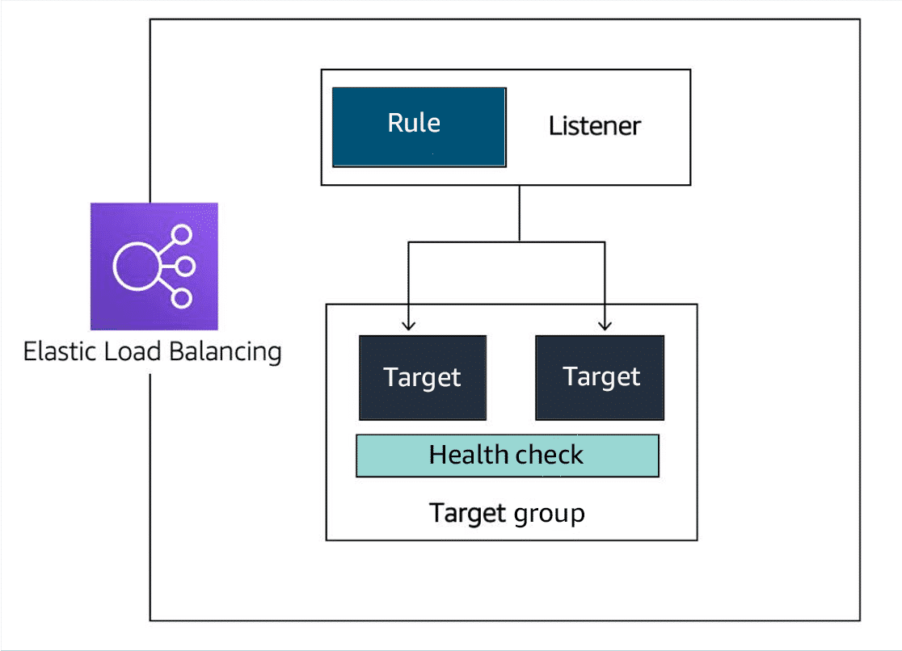

[AWS Skill Builder](https://explore.skillbuilder.aws/learn/course/1851/play/85986/aws-technical-essentials)

# Module 2 Compuete as a service

## Amazon Machine Image

When launching an EC2 instance, the first setting you configure is which operating system you want by selecting an Amazon Machine Image (AMI).

In the traditional infrastructure world, spinning up a server consists of installing an operating system from installation disks, drives, or wizards over the network. In the AWS Cloud, the operating system installation is not your responsibility. Instead, it's built into the AMI that you choose.

An AMI includes the operating system, storage mapping, architecture type, launch permissions, and any additional preinstalled software applications.

## EC2 instance lifecycle

An EC2 instance transitions between different states from the moment you create it until its termination.

1. When you launch an instance, it enters the **pending** state. When an instance is pending, billing has not started. At this stage, the instance is preparing to enter the running state. Pending is where AWS performs all actions needed to set up an instance, such as copying the AMI content to the root device and allocating the necessary networking components.

2. When your instance is **running**, it's ready to use. This is also the stage where billing begins. As soon as an instance is running, you can take other actions on the instance, such as reboot, terminate, stop, and stop-hibernate.
3. When you reboot an instance, it’s different than performing a stop action and then a start action. **Rebooting** an instance is equivalent to rebooting an operating system. The instance keeps its public DNS name (IPv4) and private and public IPv4 addresses. An IPv6 address (if applicable) remains on the same host computer and maintains its public and private IP address, in addition to any data on its instance store volumes.
4. When you stop your instance, it enters the **stopping** and then **stopped** state. This is similar to when you shut down your laptop. You can stop and start an instance if it has an Amazon Elastic Block Store (Amazon EBS) volume as its root device. When you stop and start an instance, your instance can be placed on a new underlying physical server. Your instance retains its private IPv4 addresses and if your instance has an IPv6 address, it retains its IPv6 address. When you put the instance into stop-hibernate, the instance enters the stopped state, but saves the last information or content into memory, so that the start process is faster.
5. When you **terminate** an instance, the instance stores are erased, and you lose both the public IP address and private IP address of the machine. Termination of an instance means that you can no longer access the machine. As soon as the status of an instance changes to **shutting down** or **terminated,** you stop incurring charges for that instance.

### Difference between stop and stop-hibernate

When you stop an instance, it enters the stopping state until it reaches the stopped state. AWS does not charge usage or data transfer fees for your instance after you stop it. But storage for any Amazon EBS volumes is still charged. While your instance is in the stopped state, you can modify some attributes, like the instance type. When you stop your instance, the data from the instance memory (RAM) is lost.

When you stop-hibernate an instance, Amazon EC2 signals the operating system to perform hibernation (suspend-to-disk), which saves the contents from the instance memory (RAM) to the EBS root volume. You can hibernate an instance only if hibernation is turned on and the instance meets the hibernation prerequisites.

# Module 6 Loading balancing & Scaling

## Elastic Load Balancer

The ELB service provides a major advantage over using your own solution to do load balancing. Mainly, you don’t need to manage or operate ELB. It can distribute incoming application traffic across EC2 instances, containers, IP addresses, and Lambda functions. Other key features include the following:

- **Hybrid mode –** Because ELB can load balance to IP addresses, it can work in a hybrid mode, which means it also load balances to on-premises servers.
- **High availability** - ELB is highly available. The only option you must ensure is that the load balancer's targets are deployed across multiple Availability Zones.
- **Scalability** - In terms of scalability, ELB automatically scales to meet the demand of the incoming traffic. It handles the incoming traffic and sends it to your backend application.

### Health checks

Monitoring is an important part of load balancers because they should route traffic to only healthy EC2 instances. That’s why ELB supports two types of health checks as follows:

- Establishing a connection to a backend EC2 instance using TCP and marking the instance as available if the connection is successful.
- Making an HTTP or HTTPS request to a webpage that you specify and validating that an HTTP response code is returned.

### Components of ELB

- Rule: To associate a target group to a listener, you must use a rule. Rules are made up of two conditions. The first condition is the source IP address of the client. The second condition decides which target group to send the traffic to.
- Listener: The client connects to the listener. This is often called client side. To define a listener, a port must be provided in addition to the protocol, depending on the load balancer type. There can be many listeners for a single load balancer.
- Target group: The backend servers, or server side, are defined in one or more target groups. This is where you define the type of backend you want to direct traffic to, such as EC2 instances, Lambda functions, or IP addresses. Also, a health check must be defined for each target group. 

### Types of load balancers

#### Application Load Balancer 

For our Employee Directory application, we are using an Application Load Balancer. An Application Load Balancer functions at Layer 7 of the Open Systems Interconnection (OSI) model. It is ideal for load balancing HTTP and HTTPS traffic.

You can do things similar to other load balancer like apache

- Route traffic based on request data

  - An Application Load Balancer makes routing decisions based on the HTTP and HTTPS protocol. For example, the ALB could use the URL path (/upload) and host, HTTP headers and method, or the source IP address of the client. This facilitates granular routing to target groups.

- Sends response directly to the client

  - An Application Load Balancer can reply directly to the client with a fixed response, such as a custom HTML page. It can also send a redirect to the client. This is useful when you must redirect to a specific website or redirect a request from HTTP to HTTPS. It removes that work from your backend servers.

- Uses TLS offloading

  - An Application Load Balancer understands HTTPS traffic. To pass HTTPS traffic through an Application Load Balancer, an SSL certificate is provided one of the following ways:

    - Importing a certificate by way of IAM or ACM services
    - Creating a certificate for free using ACM

    This ensures that the traffic between the client and Application Load Balancer is encrypted.

- Authenticate users
  - An Application Load Balancer can authenticate users before they can pass through the load balancer. The Application Load Balancer uses the OpenID Connect (OIDC) protocol and integrates with other AWS services to support protocols, such as the following:
    - SAML
    - Lightweight Directory Access Protocol (LDAP)
    - Microsoft Active Directory
    - Others
- Secures traffic
  - To prevent traffic from reaching the load balancer, you configure a security group to specify the supported IP address ranges.
- Supports sticky sessions
  - If requests must be sent to the same backend server because the application is stateful, use the sticky session feature. This feature uses an HTTP cookie to remember which server to send the traffic to across connections.

#### Network Load Balancer

A Network Load Balancer is ideal for load balancing TCP and UDP traffic. It functions at Layer 4 of the OSI model, routing connections from a target in the target group based on IP protocol data.

- Sticky sessions:
  - Routes requests from the same client to the same target
- Low Latency
- Source IP address
  - Preserves the client-side source IP address
- Static IP support
  - Automatically provides a static IP address per Availability Zone (subnet).
- Elastic IP address support
  - Lets users assign a custom, fixed IP address per Availability Zone (subnet).
- DNS failover
  - Uses Amazon Route 53 to direct traffic to load balancer nodes in other zones.

#### Gateway Load Balancer 

A Gateway Load Balancer helps you to deploy, scale, and manage your third-party appliances, such as firewalls, intrusion detection and prevention systems, and deep packet inspection systems. 

### Selecting between ELB types

You can select between the ELB service types by determining which feature is required for your application. The following table presents a list of some of the major features of load balancers. For a complete list, see "Elastic Load Balancing features" in the Resources section at the end of this lesson. 

| **Feature**                          | **ALB**              | **NLB**           | **GLB**                                    |
| ------------------------------------ | -------------------- | ----------------- | ------------------------------------------ |
| **Load Balancer Type**               | Layer 7              | Layer 4           | Layer 3 gateway and Layer 4 load balancing |
| **Target Type**                      | IP, instance, Lambda | IP, instance, ALB | IP, instance                               |
| **Protocol Listeners**               | HTTP, HTTPS          | TCP, UDP, TLS     | IP                                         |
| **Static IP and Elastic IP Address** |                      | Yes               |                                            |
| **Preserve Source IP Address**       | Yes                  | Yes               | Yes                                        |
| **Fixed Response**                   | Yes                  |                   |                                            |
| **User Authentication**              | Yes                  |                   |                                            |

## Auto Scaling

The Amazon EC2 Auto Scaling service adds and removes capacity to keep a steady and predictable performance at the lowest possible cost. By adjusting the capacity to exactly what your application uses, you only pay for what your application needs. This means Amazon EC2 Auto Scaling helps scale your infrastructure and ensure high availability.

### ELB with Amazon EC2 Auto Scaling

Additionally, the ELB service integrates seamlessly with Amazon EC2 Auto Scaling. As soon as a new EC2 instance is added to or removed from the Amazon EC2 Auto Scaling group, ELB is notified. However, before ELB can send traffic to a new EC2 instance, it needs to validate that the application running on the EC2 instance is available.

This validation is done by way of the ELB health checks feature you learned about in the previous lesson. 

### Configure Amazon EC2 Auto Scaling components

There are three main components of Amazon EC2 Auto Scaling. Each of these components addresses one main question as follows:

- **Launch template or configuration:** Which resources should be automatically scaled?

- **Amazon EC2 Auto Scaling groups:** Where should the resources be deployed?

  - This is where you specify the Amazon Virtual Private Cloud (Amazon VPC) and subnets the EC2 instance should be launched in. Amazon EC2 Auto Scaling takes care of creating the EC2 instances across the subnets, so select at least two subnets that are across different Availability Zones.

- **Scaling policies:** When should the resources be added or removed?

  - **Simple scaling policy**: With a simple scaling policy, you use a CloudWatch alarm and specify what to do when it is invoked. 
    - After the scaling policy is invoked, it enters a cooldown period before taking any other action.

  - **Step scaling policy**: Step scaling policies respond to additional alarms even when a scaling activity or health check replacement is in progress. 
    - Similar to the previous example, you might decide to add two more instances when CPU utilization is at 85 percent and four more instances when it’s at 95 percent.
  - **Target tracking scaling policy:**
    - If your application scales based on average CPU utilization, average network utilization (in or out), or request count, then this scaling policy type is the one to use.
    - All you need to provide is the target value to track, and it automatically creates the required CloudWatch alarms.