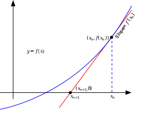
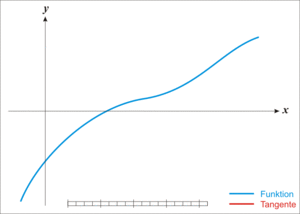

# Algorithms

## [Newton's method - Wikiwand](https://www.wikiwand.com/en/Newton's_method)


Used to find estimated root of `f(x) = 0`. Assume the current guess is $x_n$, next guess is $x_{n+1}$, then:
$$
x_{n+1} = x_n - \frac{f(x_n)}{f'(x_n)}
$$




# q language

## References

- [(20) Intro to kdb+ and q | Tutorial #2 | Q Console, Types and Lists - YouTube](https://www.youtube.com/watch?v=TBHRVCnH8u4)

## Numeric

- Plain number is 64-bit by default
  - You can add `i` suffix to declare 32-bit integer, like `3i`
- Division operator is `%` rather than `/`

## List

You can declare a list like this: `1 2 3`. Yeah, just space in-between elements

And if 2 lists have the same length, you can even add them up:

```q
// This would produce 11 22 33
1 2 3 + 10 20 30
```

You can even add a single value to a list:

```q
// Output: 3 4 5
1 + 2 3 4
// Output: 3 4 5
2 3 4 + 1
```

Similarly, you can use other operators:

```q
// Output: 1 2 3f
10 20 30 % 10
// Output: 30 60 90
10 20 30 * 3
```

When you do operation on list, it does not do the operation on every element. Instead, the operation is done in the list itself:

- `1 + til 100` and `1 + til 1000000000` would have the same speed
- For `1 + til 1000000000`, q would not evalate all the numbers until you actually visit a specific number in the list

## Operator

All operators have the same precedence (i.e. priority) and expression is evaluated from right to left so `2 * 3 + 4` would produce 14 rather than 10 (`3 + 4` is calculated first).

This looks insane but if you think operator as functions, then it makes sense:

```q
// This should return 100 because til 100 is invoked first, then count is invoked. Yeah, right to left
count til 100
```


### count

```q
// Produce length of list, output is 3
count 1 2 3
```

### til

Produce a list of number with specified length

```q
// Output is 0 1 2
til 3
```

### =

This is not assignment, it's similar to `==` in java.

```q
// Output is 1b
2 = 1 + 1
// You can also compare list. Output is 010b
1 2 3 = 3 2 1
```

Similar to `==` in Javascript, `=` in q does value check rather than type check. So  `2000.01.01 = 0` would produce `1b`

### Over `/` and  Scan`\`

You can use it with other operators to do the operation on each item in the list:

```q
// Sum up all values in the list
// This is identical to `0 + 1 + 2 + 3`. 0 is the initial value
// Output is 6
0 +/ 1 2 3
// You may not specifiy the initial value
// This is identical to `1 + 2 + 3`
// Output is 6
(+/) 1 2 3
// Output is 60
(*/) 3 4 5
// You can do factorial
// Output is 120
(*/) 1 + til 5
// Get max value in list
(|/) 10 30 20 50 40 // 50
```

`\` is similar to `/` except that it shows all intermediate result

```q 
(+\) til 5 // 0 1 3 6 10
```

And for operators like `sum`, `min`, `max`, adding `s` to the end is same as using `\`:

```q
sums til 5 // 0 1 3 6 10
```


### `|`and `&`

`|`: Get max of 2 values

```q
2 | 3 // 3
5 | 3 // 5
// And surprisingly, it would work as if it's `or` operator when used on booleans
0b | 1b // 1b
```

`&`: Get min of 2 values

```q
10 & 2 // 2
3 & 5 // 3
// And surprisingly, it would work as if it's `and` operator when used on booleans
0b & 1b // 0b
```

### sum, min and max

```q
sum 1 2 3 4 5 // 15
min 1 2 3 4 5 // 1
max 1 2 3 4 5 // 5
```

### #

```q
// Take first 2 elements
2#1 2 3 4 5 // 1 2 
// Take last 2 elements
-2#1 2 3 4 5 // 4 5
```

### Comma `,`

Join two lists

```q
1 2 3 , 4 5 6 // 1 2 3 4 5 6
```

## Boolean

Each boolean is stored in a byte and true is `1b`, false is `0b` (b is short for binary)

Boolean list is also special, `101b` represents a list of booleans: true false true

## Date

One sample date: `2023.01.12`

Under the hood, the date is stored as number of days since 2000-01-01. So `2000.01.01 = 0` would produce `1b`

For days before 2000-01-01, the value would a negaitve number: `1999.12.31 = -1`

Since under the hood is a day count, so you can do arithmetic operation:

```q
// Produces 2020.02.29
2020.01.01 + 59
// Produces 31i
2000.02.01 - 2000.01.01
```

## Month

One sample date: 2000.01m

Similar to date, what's behind is number of months since 2000-01

## Casting

```q
// Cast float number 1.0 to long
// $ is the casting operator
// ` prefix is to mark long as a literal
// Produces 1
`long$1.0
// Produces 1f
`float$1
// Produces 1b
`boolean$1
// Produces 2000.02.01
`date$31
```

## function

```q
// {[x]x*x} is the function
//  x inside [] is the parameter
//  x*x is the function body and result is the function's result value
// [5] is to invoke the function with parameter 5
{[x]x*x}[5] // 25
// The bracket around parameter can be omitted:
{[x]x*x}5 // 25
// If parameter is x, y or z, then the function parameter can be omitted:
{x*x}5 // 25
// Multiple parameters:
{[x;y] x * y}[2;3] // 6
```

You may use `/` & `\` to invoke function recursively. Here is an [example](https://code.kx.com/q4m3/1_Q_Shock_and_Awe/#113-example-newtons-method-for-nth-roots) to calculate $\sqrt2$ using Newton's method:

```q
// Displays all digits of the underlying binary representation, including the 17th digit,
\P 0
// Invoke the function with parameter 1.0, then invoke it again with previous invocation's return value... Repeat until the result converges, i.e. diff is less than 10^-14
{x - ((x * x) - 2) % (2 * x)}/[1.0] // 1.4142135623730951
// Default console size is 25 height 80 width, run following command to make it larger:
\c 25 200i
// You can also use use \ to show intermediate result
{x - ((x * x) - 2) % (2 * x)}\[1.0] //1 1.5 1.4166666666666667 1.4142156862745099 1.4142135623746899 1.4142135623730951
```

You can also use it to generate fibonacci sequence:

```q
// Invoke it 5 times
{x, sum -2#x}/[5;1 1] // 1 1 2 3 5 8 13
```

## Variable

```q
// Declare a variable a and assign value 42 to a
a:42
a * 2 // 84
```

Suppose we have 12 shares to sell, and the incoming buy orders' quantities are 2, 1, 4, 3, 5, 4. Now we want to return each order's filled quantity. i.e. 2, 1, 4, 3, 2, 0

```q
buys:2 1 4 3 5 4
sell:12
// sums calculate running sums: 1 5 7 10 15 19
// & is to get minimum of the two numbers: 2 3 7 10 12 12
// deltas would give diff of each number with its previous number (for the first number, original value is returned)
deltas sell & sums buys // 2 1 4 3 2 0
```

