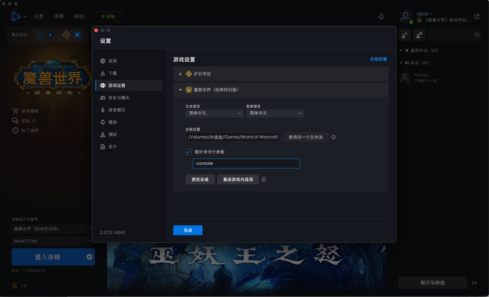

# 参考资料

- 当前文件夹里的 World of Warcraft Programming A Guide and Reference for Creating WoW Addons (James Whitehead, Ii, Rick Roe) (Z-Library).pdf
- https://wowpedia.fandom.com/wiki/Console

# Tools

## 如何开启console

启动魔兽世界的时候加参数-console，如下图所示：



进入游戏后，在聊天中输入`/run SetConsoleKey("z")`

这样按z键就可以打开console。这个console在角色选择页面也可以打开

## 如何取得wow原生界面/插件的代码

开启console后，在角色选择页面输入：

```bash
ExportInterfaceFiles code
ExportInterfaceFiles art
```

执行之后会在游戏安装路径生成两个文件夹："BlizzardInterfaceCode" and "BlizzardInterfaceArt" f

## 如何将BLP文件转换成png

可以用工具[BLPConverter](https://www.wowinterface.com/downloads/info14110-BLPConverter.html)

这个工具只能在Windows下运行，这个文件夹里存了一份这个工具的复制。

在Windows下，可以用一下bat批量把所有的blp文件都转换成png：

```bat
@echo off
setlocal
set "source_folder=C:\temp\BlizzardInterface Code&Art"
set "converter_path=c:\temp\BLPConverter_8-4\BLPConverter.exe"
set "log_file=C:\temp\blp_conversion_log.txt"

echo %date% %time% - Conversion Start > "%log_file%"

for /R "%source_folder%" %%F in (*.blp *.BLP) do (
    echo Processing file: %%F
    echo %date% %time% - Processing file: %%F >> "%log_file%"
    "%converter_path%" "%%F"
)

echo %date% %time% - Conversion Complete >> "%log_file%"

endlocal
```

