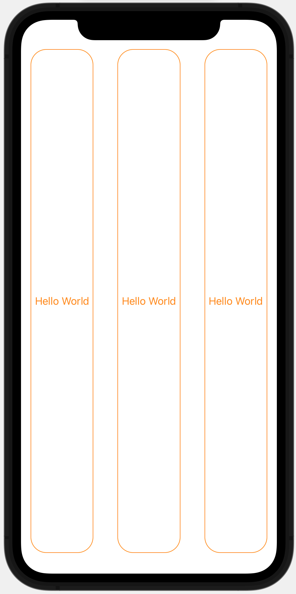
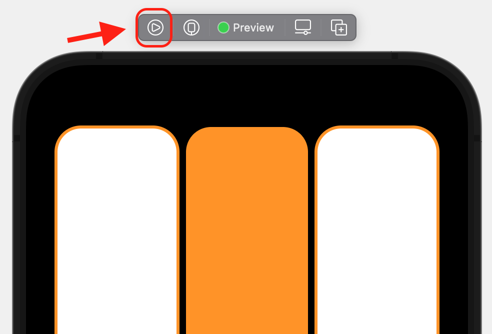
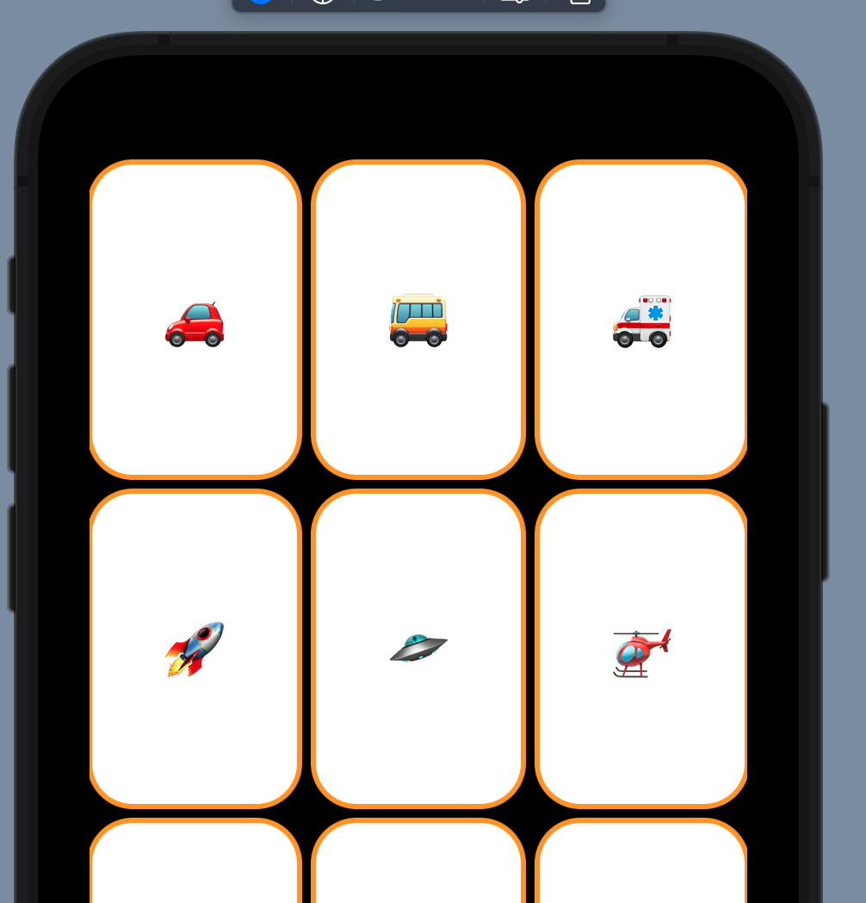
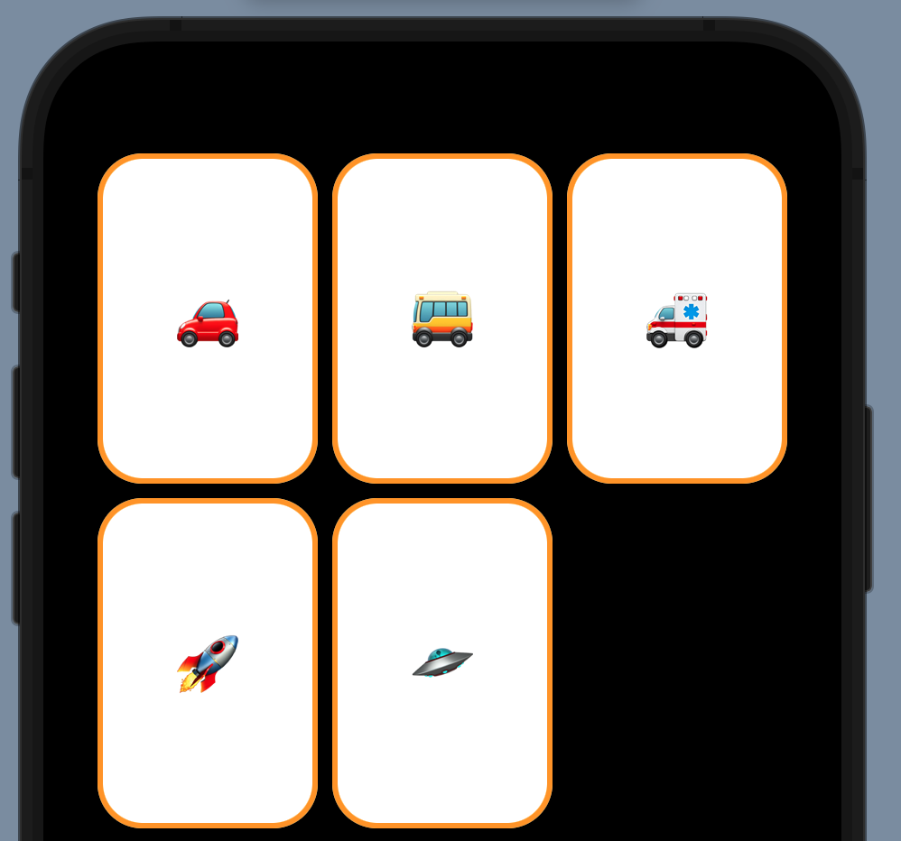

# [Lecture 2: Learning more about SwiftUI - YouTube](https://www.youtube.com/watch?v=3lahkdHEhW8&list=PLpGHT1n4-mAsxuRxVPv7kj4-dQYoC3VVu&index=2)

## HStack

It's a combiner that combine multiple views horizontally

```swift
HStack{
    ZStack {
        RoundedRectangle(cornerRadius: 25.0)
            .stroke()
            .padding(.horizontal)
        Text("Hello World")
    }
    ZStack {
        RoundedRectangle(cornerRadius: 25.0)
            .stroke()
            .padding(.horizontal)
        Text("Hello World")
    }
    ZStack {
        RoundedRectangle(cornerRadius: 25.0)
            .stroke()
            .padding(.horizontal)
        Text("Hello World")
    }
}.foregroundColor(Color.orange)
```



## Extract a New View

```swift
struct ContentView: View {
    var body: some View {
        HStack{
            CardView()
            CardView()
            CardView()
        }.foregroundColor(Color.orange)
    }
}

struct CardView: View {
    var body: some View {
        ZStack {
            RoundedRectangle(cornerRadius: 25.0)
                .stroke()
                .padding(.horizontal)
            Text("Hello World")
        }
    }
}
```

The screen would still looks the same

## Emojis

You can insert emojis via `Edit -> Emojis & Symbols` in Xcode. Or via shortcut `Ctrl + Command + Space`

## Configure Xcode Previewer

e.g. You can make previewer show 2 iPhones, one in dark mode and one in light mode

**Before**

```swift
struct ContentView_Previews: PreviewProvider {
    static var previews: some View {
        ContentView()
    }
}
```

**After**

```swift
struct ContentView_Previews: PreviewProvider {
    static var previews: some View {
        ContentView()
            .preferredColorScheme(.dark)
        ContentView()
            .preferredColorScheme(.light)
    }
}
```

You can configure more things like iPhone type. Check inspection part for more details

## Give stroke RoundedRectangle background color

There is no way to do it with single RoundedRectangle, but we can achieve it via ZStack:

```swift
struct CardView: View {
    var body: some View {
        ZStack {
            // This would give a white background
            RoundedRectangle(cornerRadius: 25.0)
                .fill()
                .foregroundColor(.white)
            RoundedRectangle(cornerRadius: 25.0)
                .stroke(lineWidth: 3)
            Text("✈️")
                .font(.largeTitle)
        }
    }
}
```

## Struct Variable and if-else in view builder

```swift
struct ContentView: View {
    var body: some View {
        HStack{
            CardView()
            // For any struct, if it does not have any constructor, then its default constructor allows you to initialize/override any variable in the struct
            CardView(isFaceUp: false)
            CardView()
        }
        .padding(.horizontal)
        .foregroundColor(Color.orange)
    }
}

struct CardView: View {
    var isFaceUp: Bool = true
    var body: some View {
        ZStack {
            // This is a view builder and you can declare variable and use if-else clause
            // let is identical to const in js
            // If you want to make it non-constant, use `var` instead
            let cardRectangle: RoundedRectangle = RoundedRectangle(cornerRadius: 25.0)
            // It's identical to self.isFaceUp
            if (isFaceUp) {
                cardRectangle.fill().foregroundColor(.white)
                cardRectangle.stroke(lineWidth: 3)
                Text("✈️").font(.largeTitle)
            }
            else {
                cardRectangle.fill()
            }
        }
    }
}

```


## onTap listener and `@State`

You can register a on tap listener by using modifier `onTapGesture`

```swift
struct CardView: View {
    @State var isFaceUp: Bool = true
    var body: some View {
        ZStack {
            let cardRectangle: RoundedRectangle = RoundedRectangle(cornerRadius: 25.0)
            if (self.isFaceUp) {
                cardRectangle.fill().foregroundColor(.white)
                cardRectangle.stroke(lineWidth: 3)
                Text("✈️").font(.largeTitle)
            }
            else {
                cardRectangle.fill()
            }
        }
        .onTapGesture {
            // If you remove `@State` from isFaceUp, then compiler error would be raised because View is immutable
            // And adding @State is not making the View mutable, what it does is to change isFaceUp from a boolean value to a pointer that points a small piece of memory, which stores the value. So the pointer itself is immutable, what's changed is only the small piece of memory
            isFaceUp = !isFaceUp;
        }
    }
}
```

By default, when clicking the previewer, it would select the view. To make it response like a real iPhone, click following button:




## Use option + click to read doc

And in the end of the opened popup, there is a link: Open in Developer Documentation, which would gives you more detail

## Use `ForEach` and array

```swift
struct ContentView: View {
    
    // You can replace Array<String> with [String]
    // You can also remove this type because swift can get type from the value
    var emojis: Array<String> = ["🚗", "🚌", "🚑"]
    
    var body: some View {
        HStack{
            // ForEach is not a view, it's kind of a view builder
            // Like in react, which needs you to specify key when rendering component list. When rendering view list, you have to specify id of each view's data. The data is string and it does not have an id, so I'll use itself as id, i.e. `id: \.self`
            ForEach(emojis, id: \.self, content: {emoji in
                CardView(content: emoji)
            })
        }
        .padding(.horizontal)
        .foregroundColor(Color.orange)
    }
}
```

And you can slice an array like below:

```swift
struct ContentView: View {
    
    var emojis = ["🚗", "🚌", "🚑", "🚀", "🛸", "🚁", "🛶", "⛵️", "🚤", "🛥", "🛳", "🪝", "⚓️", "🚢", "⛴", "⛽️", "🚧", "🚦", "🚥", "🗽", "🗿", "🗺", "🚏", "🗼", "🏰"]
    var emojiCount = 5
    
    var body: some View {
        HStack{
            // This is to slice the array within range [0, emojiCount)
            // If you want to change to [0, emojiCount], then use [0...emojiCount]
            ForEach(emojis[0..<emojiCount], id: \.self, content: {emoji in
                CardView(content: emoji)
            })
        }
        .padding(.horizontal)
        .foregroundColor(Color.orange)
    }
}
```

## Spacer and Button

```swift
struct ContentView: View {    
    var emojis = ["🚗", "🚌", "🚑", "🚀", "🛸", "🚁", "🛶", "⛵️", "🚤", "🛥", "🛳", "🪝", "⚓️", "🚢", "⛴", "⛽️", "🚧", "🚦", "🚥", "🗽", "🗿", "🗺", "🚏", "🗼", "🏰"]
    @State var emojiCount = 5
    
    var body: some View {
        VStack{
            HStack{
                ForEach(emojis[0..<emojiCount], id: \.self, content: {emoji in
                    CardView(content: emoji)
                })
            }
            // You can give it a minLength, but it's recommended to make it adjust itself so that it would work well in multiple devices
            Spacer()
            HStack{
                // This is the removeButton variable
                removeButton
                // This would consume all free space. So that remove button would be left aligned and add button would be right aligned
                Spacer()
                addButton
            }
            .font(.largeTitle)
        }
        .padding(.horizontal)
        .foregroundColor(Color.orange)
    }
    
    var addButton: some View {
        Button(action: {
            if (emojiCount < emojis.count) {
                emojiCount += 1;
            }
        }, label: {
            Image(systemName: "plus.circle") // plus.circle comes from an app that Apple provides: SF Symbols
        })
    }
    
    var removeButton: some View {
        Button(action: {
            if (emojiCount > 1) {
                emojiCount -= 1;
            }
        }, label: {
            Image(systemName: "minus.circle")
        })
    }
}
```

If one function has 2 functional arguments, we can still simplify it like below:

```swift
var addButton: some View {
    Button { // This function is the first argument
        if (emojiCount < emojis.count) {
            emojiCount += 1;
        }
    } label: { // This function is the second argument, and argument name is label
        Image(systemName: "plus.circle")
    }
}
```

## aspectRatio, ScrollView and LazyVGrid

```swift
VStack{
    // This is to make content viewable
    ScrollView {
        // This is called lazy because it would only render items that are visible on the screen
        // i.e. only call the body var function when the view appears on the screen
        // The 3 GridItem() is to display fixed 3 rows
        LazyVGrid(columns: [GridItem(), GridItem(), GridItem()]) {
            ForEach(emojis[0..<emojiCount], id: \.self, content: {emoji in
                // The aspectRatio is to make width/height = 2/3
                CardView(content: emoji).aspectRatio(2/3, contentMode: .fit)
            })
        }
    }
    Spacer()
    HStack{
        removeButton
        Spacer()
        addButton
    }
    .font(.largeTitle)
}
.padding(.horizontal)
.foregroundColor(Color.orange)
```

## strokeBorder & stroke

`stroke` would remove what's in the middle and render the border. However, half of the border is outside the view. So the view can be cut off by something like `ScrollView`:



To make the border fully render inside the view, yon can use `strokeBorder` instead:

```swift
struct CardView: View {
    var content: String;
    @State var isFaceUp: Bool = true
    var body: some View {
        ZStack {
            let cardRectangle: RoundedRectangle = RoundedRectangle(cornerRadius: 25.0)
            if (self.isFaceUp) {
                cardRectangle.fill().foregroundColor(.white)
                cardRectangle.strokeBorder(lineWidth: 3)
                Text(content).font(.largeTitle)
            }
            else {
                cardRectangle.fill()
            }
        }
        .onTapGesture {
            isFaceUp = !isFaceUp;
        }
    }
}
```




## Achieve float with LazyVGrid

Now we have 3 fixed columns even if the iPhone is rotated, it would be ideal we can make the card float from left to right like text. This can be achieved with `.adaptive`:

```swift
LazyVGrid(columns: [GridItem(.adaptive(minimum: 80))]) {
    ForEach(emojis[0..<emojiCount], id: \.self, content: {emoji in
        CardView(content: emoji).aspectRatio(2/3, contentMode: .fit)
    })
}
```

## Final Code

```swift
//
//  ContentView.swift
//  Memorize
//
//  Created by 孙国强 on 2021/08/15.
//
	
import SwiftUI

struct ContentView: View {
    var emojis = ["🚗", "🚌", "🚑", "🚀", "🛸", "🚁", "🛶", "⛵️", "🚤", "🛥", "🛳", "🪝", "⚓️", "🚢", "⛴", "⛽️", "🚧", "🚦", "🚥", "🗽", "🗿", "🗺", "🚏", "🗼", "🏰"]
    @State var emojiCount = 5
    
    var body: some View {
        VStack{
            ScrollView {
                LazyVGrid(columns: [GridItem(.adaptive(minimum: 80))]) {
                    ForEach(emojis[0..<emojiCount], id: \.self, content: {emoji in
                        CardView(content: emoji).aspectRatio(2/3, contentMode: .fit)
                    })
                }
            }
            Spacer()
            HStack{
                removeButton
                Spacer()
                addButton
            }
            .font(.largeTitle)
        }
        .padding(.horizontal)
        .foregroundColor(Color.orange)
    }
    
    var addButton: some View {
        Button {
            if (emojiCount < emojis.count) {
                emojiCount += 1;
            }
        } label: {
            Image(systemName: "plus.circle")
        }
    }
    
    var removeButton: some View {
        Button(action: {
            if (emojiCount > 1) {
                emojiCount -= 1;
            }
        }, label: {
            Image(systemName: "minus.circle")
        })
    }
}

struct CardView: View {
    var content: String;
    @State var isFaceUp: Bool = true
    var body: some View {
        ZStack {
            let cardRectangle: RoundedRectangle = RoundedRectangle(cornerRadius: 25.0)
            if (self.isFaceUp) {
                cardRectangle.fill().foregroundColor(.white)
                cardRectangle.strokeBorder(lineWidth: 3)
                Text(content).font(.largeTitle)
            }
            else {
                cardRectangle.fill()
            }
        }
        .onTapGesture {
            isFaceUp = !isFaceUp;
        }
    }
}

struct ContentView_Previews: PreviewProvider {
    static var previews: some View {
        ContentView()
            .previewDevice("iPhone 11")
            .preferredColorScheme(.light)
    }
}
```


