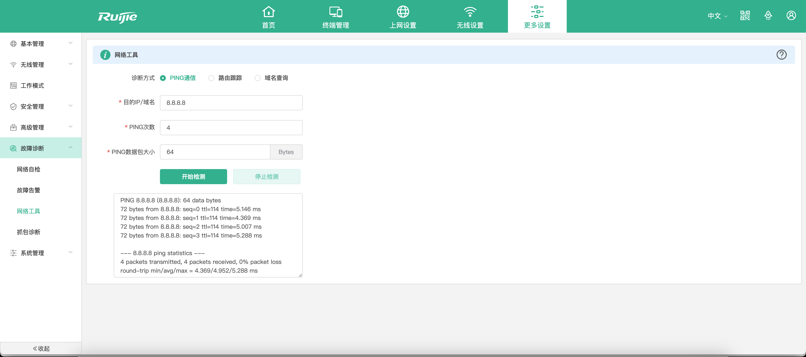
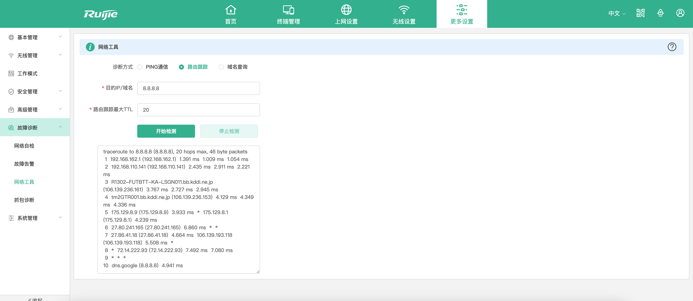
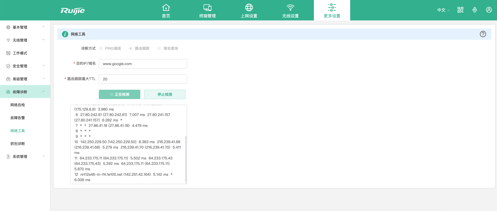
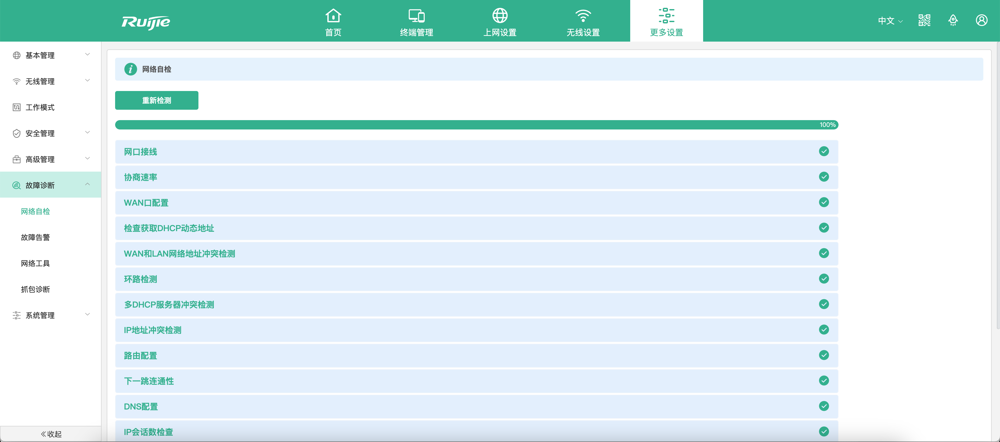
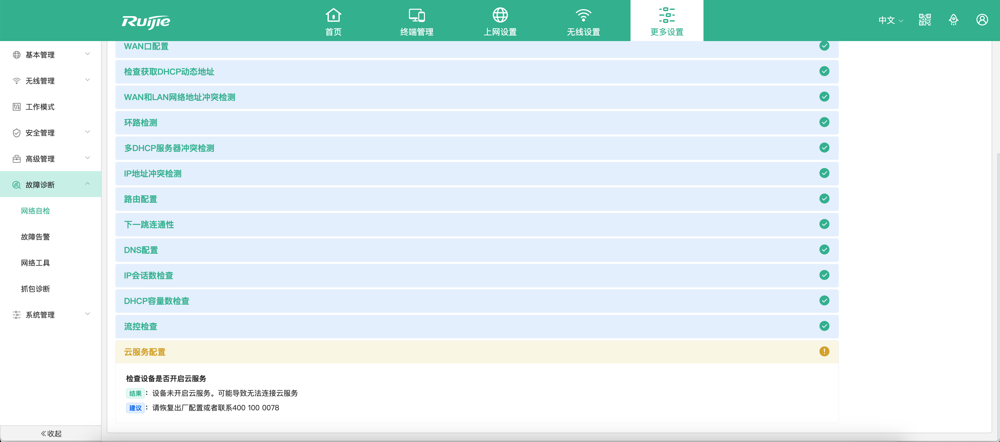

在本地电脑上ping, traceroute/tracert以下地址：

- 192.168.110.1
- 8.8.8.8
- www.google.com

在路由器管理页面上的故障诊断->网络工具，ping和路由跟踪以下地址：

- 8.8.8.8
- www.google.com

在路由器管理页面上做网络自检


case id：CS20231202-2815485

https://www.ruijienetworks.com/rita


## 192.168.110.1

### ping

```
~ » ping 192.168.110.1
PING 192.168.110.1 (192.168.110.1): 56 data bytes
64 bytes from 192.168.110.1: icmp_seq=0 ttl=64 time=0.619 ms
64 bytes from 192.168.110.1: icmp_seq=1 ttl=64 time=0.606 ms
64 bytes from 192.168.110.1: icmp_seq=2 ttl=64 time=0.647 ms
64 bytes from 192.168.110.1: icmp_seq=3 ttl=64 time=0.662 ms
```

### traceroute

```
~ » traceroute 192.168.110.1
traceroute to 192.168.110.1 (192.168.110.1), 64 hops max, 52 byte packets
 1  192.168.110.1 (192.168.110.1)  0.876 ms  0.803 ms  0.561 ms
```

## 8.8.8.8

### ping

```
~ » ping 8.8.8.8
PING 8.8.8.8 (8.8.8.8): 56 data bytes
Request timeout for icmp_seq 0
Request timeout for icmp_seq 1
Request timeout for icmp_seq 2
Request timeout for icmp_seq 3
Request timeout for icmp_seq 4
```

### traceroute

This took several minutes

```
~ » traceroute 8.8.8.8
traceroute to 8.8.8.8 (8.8.8.8), 64 hops max, 52 byte packets
 1  192.168.110.1 (192.168.110.1)  1.123 ms  0.438 ms  0.549 ms
 2  192.168.162.1 (192.168.162.1)  1.551 ms  1.565 ms  1.534 ms
 3  * * *
 4  * * *
 5  * * *
 6  175.129.8.1 (175.129.8.1)  5.367 ms  9.066 ms  5.439 ms
 7  * * *
 8  * * *
 9  * * *
10  * * *
11  * * dns.google (8.8.8.8)  6.127 ms
```

## www.google.com

### ping

```
~ » ping www.google.com
PING www.google.com (142.251.42.164): 56 data bytes
64 bytes from 142.251.42.164: icmp_seq=0 ttl=54 time=5.960 ms
64 bytes from 142.251.42.164: icmp_seq=1 ttl=54 time=7.740 ms
64 bytes from 142.251.42.164: icmp_seq=2 ttl=54 time=5.231 ms
64 bytes from 142.251.42.164: icmp_seq=3 ttl=54 time=5.465 ms
64 bytes from 142.251.42.164: icmp_seq=4 ttl=54 time=6.331 ms
64 bytes from 142.251.42.164: icmp_seq=5 ttl=54 time=6.854 ms
64 bytes from 142.251.42.164: icmp_seq=6 ttl=54 time=6.963 ms
```

### traceroute

This took several minutes

```
~ » traceroute www.google.com
traceroute to www.google.com (142.251.42.164), 64 hops max, 52 byte packets
 1  192.168.110.1 (192.168.110.1)  1.071 ms  0.670 ms  0.472 ms
 2  192.168.162.1 (192.168.162.1)  1.588 ms  1.656 ms  1.533 ms
 3  * * 192.168.110.141 (192.168.110.141)  3.462 ms
 4  * r1302-futbtt-ka-lsgn011.bb.kddi.ne.jp (106.139.236.161)  4.134 ms *
 5  * tm2gtr001.bb.kddi.ne.jp (106.139.236.153)  8.475 ms  6.216 ms
 6  175.129.8.1 (175.129.8.1)  5.590 ms  5.844 ms
    175.129.8.9 (175.129.8.9)  6.076 ms
 7  106.139.194.97 (106.139.194.97)  7.101 ms
    27.86.45.209 (27.86.45.209)  5.967 ms
    27.80.241.153 (27.80.241.153)  8.160 ms
 8  27.86.121.178 (27.86.121.178)  5.855 ms *
    27.86.41.18 (27.86.41.18)  5.582 ms
 9  72.14.222.93 (72.14.222.93)  6.099 ms  8.011 ms  7.146 ms
10  * * *
11  142.250.226.6 (142.250.226.6)  6.078 ms
    209.85.253.56 (209.85.253.56)  5.845 ms
    142.251.226.140 (142.251.226.140)  7.267 ms
12  64.233.175.11 (64.233.175.11)  5.772 ms  6.018 ms *
13  nrt12s46-in-f4.1e100.net (142.251.42.164)  5.737 ms  6.057 ms *
```

## 故障诊断-网络工具

### 8.8.8.8





### www.google.com




卡在这里不动了，所以显示正在检测。

因为有滚动条，上面的截图不能显示完整内容。完整的内容如下：

```
traceroute to www.google.com (142.251.42.164), 20 hops max, 46 byte packets
 1  192.168.162.1 (192.168.162.1)  1.088 ms  3.102 ms  0.999 ms
 2  192.168.110.141 (192.168.110.141)  2.385 ms  3.080 ms  2.651 ms
 3  R1302-FUTBTT-KA-LSGN011.bb.kddi.ne.jp (106.139.236.161)  2.591 ms  3.267 ms  3.023 ms
 4  tm2GTR001.bb.kddi.ne.jp (106.139.236.153)  6.346 ms  4.563 ms  *
 5  *  175.129.8.1 (175.129.8.1)  4.791 ms  175.129.8.9 (175.129.8.9)  3.980 ms
 6  27.80.242.61 (27.80.242.61)  7.007 ms  27.80.241.157 (27.80.241.157)  6.282 ms  *
 7  *  *  27.86.41.18 (27.86.41.18)  4.479 ms
 8  *  *  *
 9  *  *  *
10  142.250.229.50 (142.250.229.50)  8.383 ms  216.239.41.68 (216.239.41.68)  5.279 ms  216.239.41.70 (216.239.41.70)  5.411 ms
11  64.233.175.11 (64.233.175.11)  5.502 ms  64.233.175.43 (64.233.175.43)  5.292 ms  64.233.175.11 (64.233.175.11)  5.870 ms
12  nrt12s46-in-f4.1e100.net (142.251.42.164)  5.142 ms  *  6.008 ms
```

## 网络自检



